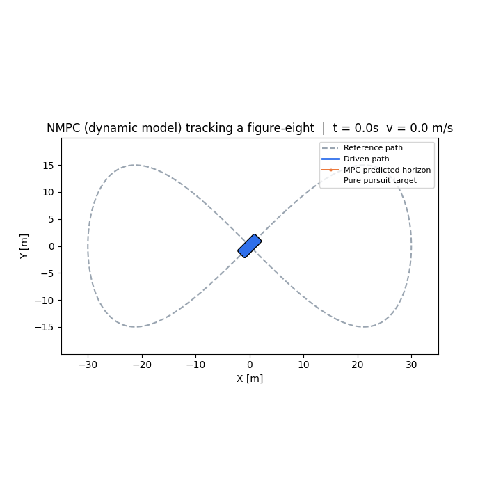
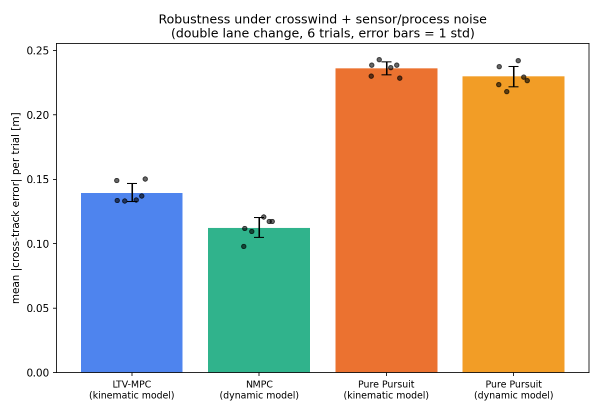
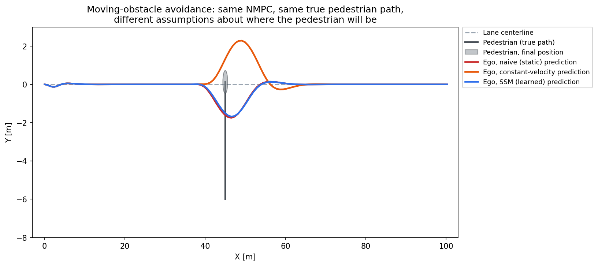
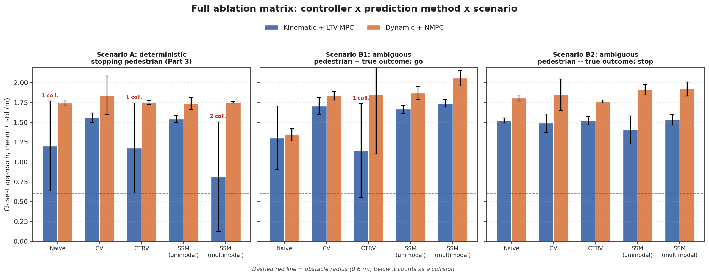
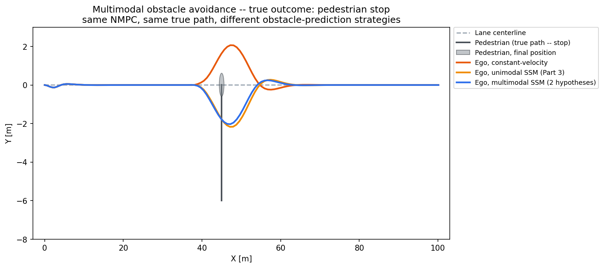
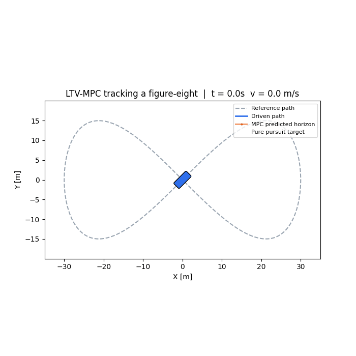
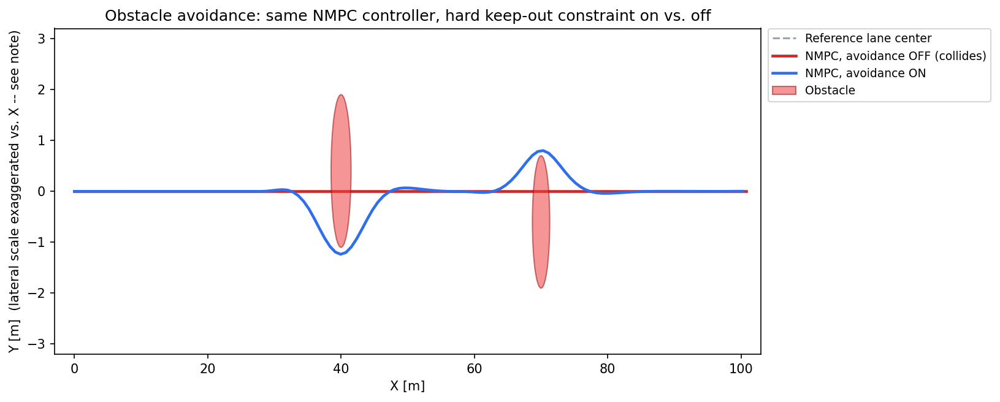
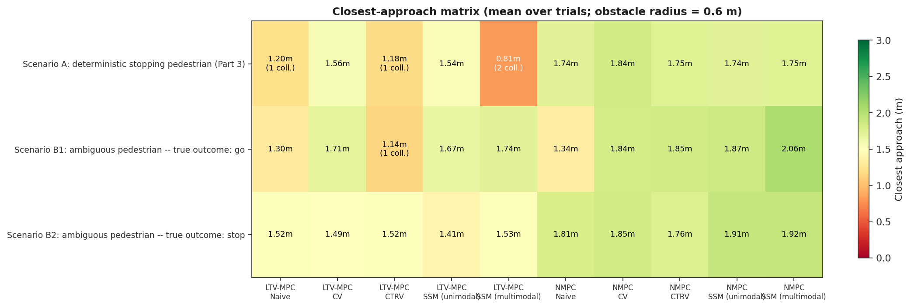
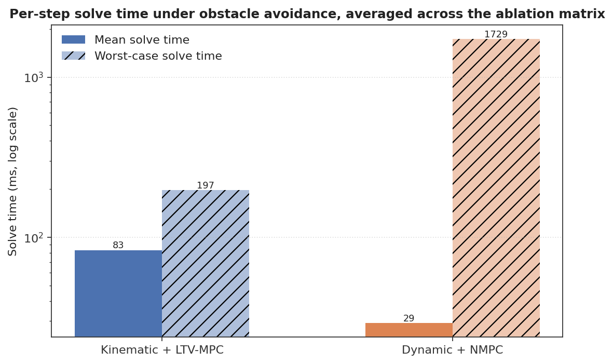

# Vehicle Trajectory Tracking with State-Space Modeling and MPC

A from-scratch, incrementally-built research project on **Model Predictive Control
(MPC)** for autonomous vehicle trajectory tracking, in five parts of increasing
fidelity and scope:

1. A **kinematic bicycle model** controlled by **Linear Time-Varying MPC** (a convex
   QP, `cvxpy` + `OSQP`), benchmarked against classical **pure pursuit**.
2. A **dynamic bicycle model** (tire slip, lateral forces) controlled by **Nonlinear
   MPC** (`CasADi` + `IPOPT`), extended with **static obstacle avoidance** and stress-
   tested for **robustness to crosswind and sensor/process noise**.
3. A **learned structured state-space sequence model** (S4D, `PyTorch`) that
   forecasts a *moving* obstacle's future trajectory from its recently observed
   motion, fed directly into the NMPC's obstacle constraint so the controller can
   react to where a pedestrian is *going*, not just where it last saw them.
4. A **multimodal (K-hypothesis) extension** of that predictor for genuinely
   ambiguous obstacles, plus **scenario-based NMPC** that stays clear of every
   plausible future simultaneously rather than betting on the most likely one.
5. A **comprehensive comparative study**: every controller (kinematic+LTV-MPC,
   dynamic+NMPC) against every prediction method (naive/CV/CTRV/unimodal
   SSM/multimodal SSM) on standardized scenarios, a **selective (Mamba-style) SSM**
   predictor upgrade to genuine research scale (~330k / ~212k parameters, up from
   ~27.6k), convex obstacle avoidance added to the QP controller, and 2D
   simulator (highway-env) replay visuals.

Every result below is measured, not asserted — including the results that don't
flatter this project's own methods (pure pursuit beats MPC on a circle; several real
NMPC/QP convergence bugs found via stress-testing and benchmarking; a mixture model
that only partially specializes; a QP-based obstacle avoidance scheme that collides
more often than NMPC's exact constraint — and how each finding was investigated).



## Table of contents

- [Why this project](#why-this-project)
- [Results at a glance](#results-at-a-glance)
- [Part 1: kinematic model + LTV-MPC](#part-1-kinematic-model--ltv-mpc)
- [Part 2: dynamic model + NMPC](#part-2-dynamic-model--nmpc)
- [Part 3: moving-obstacle prediction with a learned state-space model](#part-3-moving-obstacle-prediction-with-a-learned-state-space-model)
- [Part 4: multimodal prediction + scenario-based NMPC](#part-4-multimodal-prediction--scenario-based-nmpc)
- [Part 5: comprehensive comparative study](#part-5-comprehensive-comparative-study)
- [Repository layout](#repository-layout)
- [Running it](#running-it)
- [Extensions](#extensions)
- [References](#references)

## Why this project

Trajectory tracking sits at the intersection of controls theory, optimization, and
robotics — a bicycle model gives a clean, well-posed state-space system; MPC turns
"drive along this path while respecting actuator limits" into an optimization problem
solved every 100 ms; and a classical baseline (pure pursuit) makes it possible to
show, quantitatively, what the optimization buys you (and where it doesn't). Going
from a kinematic model + convex QP to a dynamic model + nonlinear program is also a
natural, well-trodden path in the controls literature — the project is structured to
show that progression explicitly, including the friction (a real solver-convergence
bug, tuning a hard obstacle constraint that was initially too weak) rather than
presenting only the polished end state.

## Results at a glance

**Part 1 — kinematic model + LTV-MPC vs. pure pursuit:**

| Trajectory | Controller | Mean \|cross-track error\| | Max \|cross-track error\| |
|---|---|---|---|
| Figure-eight (tight, varying curvature) | **MPC** | **0.087 m** | **0.261 m** |
| Figure-eight | Pure Pursuit | 0.164 m | 0.486 m |
| Double lane change (ISO 3888-style) | **MPC** | **0.013 m** | **0.067 m** |
| Double lane change | Pure Pursuit | 0.059 m | 0.227 m |
| Constant-radius circle | MPC | 0.120 m | 0.248 m |
| Constant-radius circle | **Pure Pursuit** | **0.009 m** | **0.011 m** |

The interesting result isn't "MPC always wins" — it's *where* it wins. MPC's
look-ahead over the horizon lets it anticipate curvature and speed changes, so it
clearly outperforms pure pursuit on the figure-eight and the lane change, both of
which demand reacting to upcoming geometry. On a constant-radius circle, though,
pure pursuit's simple geometric law is a near-perfect match for the path shape, and
edges MPC out. That trade-off — a model-based optimizer's generality vs. a
classical controller's fit to a specific geometry — is a big part of why MPC is used
in practice for the harder cases.

**Part 2 — dynamic model (tire slip) + NMPC vs. pure pursuit:**

| Trajectory | Controller | Mean \|cross-track error\| | Max \|cross-track error\| |
|---|---|---|---|
| Figure-eight | **NMPC** | **0.035 m** | **0.136 m** |
| Figure-eight | Pure Pursuit | 0.339 m | 1.097 m |
| Double lane change | **NMPC** | **0.011 m** | **0.132 m** |
| Double lane change | Pure Pursuit | 0.052 m | 0.211 m |

Against the more realistic (and harder) dynamic model, NMPC's advantage over pure
pursuit *widens* rather than narrows — pure pursuit is a purely geometric law with no
notion of tire slip, so it has no way to compensate for the vehicle sliding; NMPC
optimizes directly against the true nonlinear dynamics (no linearization at all,
unlike Part 1's LTV-MPC) and corrects for it every step.

**Robustness under crosswind + sensor/process noise** (double lane change,
6 Monte Carlo trials per controller, identical disturbance realizations across
controllers):

| Controller | Mean \|cross-track error\| across trials |
|---|---|
| **NMPC** (dynamic model) | **0.113 ± 0.008 m** |
| LTV-MPC (kinematic model) | 0.140 ± 0.007 m |
| Pure Pursuit (dynamic model) | 0.230 ± 0.008 m |
| Pure Pursuit (kinematic model) | 0.236 ± 0.005 m |

Both MPC variants degrade far more gracefully than pure pursuit under disturbance —
their look-ahead lets them start correcting a drift before it compounds, where pure
pursuit only ever reacts to where it's aiming *right now*. NMPC edges out LTV-MPC
here too, consistent with Part 2. See
[Robustness to disturbances](#extension-robustness-to-disturbances) below for the
disturbance model and why the gap is a real, reproducible effect (low trial-to-trial
variance) rather than noise-realization luck.



**Part 3 — learned trajectory prediction vs. classical baselines** (held-out test
set, ADE/FDE in meters, lower is better):

| Predictor | ADE | FDE |
|---|---|---|
| **SSM (selective, ~330k params)** | **0.482 ± 0.329 m** | **0.927 ± 0.654 m** |
| Constant velocity (CV) | 0.704 ± 0.454 m | 1.381 ± 0.860 m |
| Constant turn rate + velocity (CTRV) | 1.515 ± 0.906 m | 2.996 ± 1.856 m |

(As of the Part 5 research-scale upgrade, this is a *selective* S4D block — Mamba-style
input-dependent discretization, ~330k parameters — not the original ~27.6k-parameter
plain-S4D demo model; see [Part 5](#part-5-comprehensive-comparative-study) for the
architecture change and why.)

**Part 3 — moving-obstacle avoidance** (8 Monte Carlo trials, identical true
pedestrian trajectory + sensor noise per trial across all three obstacle-prediction
methods):

| Obstacle prediction | Closest approach | Max lateral deviation | Collisions |
|---|---|---|---|
| Naive (static, last-seen position) | 1.75 ± 0.02 m | 1.89 ± 0.22 m | 0/8 |
| Constant velocity (CV) | 1.50 ± 0.49 m | 2.22 ± 1.01 m | 0/8 |
| **SSM (learned)** | **1.74 ± 0.10 m** | 2.07 ± 0.48 m | 0/8 |

The SSM predictor wins on both trajectory-forecasting accuracy and the metric that
actually matters downstream — it gives the *safest and most consistent* avoidance
(highest mean closest-approach, by far the lowest trial-to-trial variance), because
it's the only method that recognizes a decelerating pedestrian as decelerating and
reacts accordingly. See
[Part 3: moving-obstacle prediction](#part-3-moving-obstacle-prediction-with-a-learned-state-space-model)
below for the honest version of this story, including where the SSM predictor is
*not* simply better (it loses narrowly to CV on the `constant_turn` pattern) and why
lateral deviation isn't a "lower is better" metric here.



**Part 4 — genuinely ambiguous obstacles: multimodal prediction + scenario-based
NMPC** (6 trials per true outcome, identical NMPC controller, only the
obstacle-prediction strategy changes):

| Prediction strategy | Closest approach — pedestrian stops | Closest approach — pedestrian continues |
|---|---|---|
| Constant velocity (CV) | 1.61 ± 0.27 m | **2.62 ± 0.53 m** |
| Unimodal SSM (Part 3) | 1.70 ± 0.07 m | 2.50 ± 0.60 m |
| **Multimodal SSM (2 hypotheses)** | **1.79 ± 0.14 m** | 2.58 ± 0.52 m |

Zero collisions for every method across all 36 trials. The multimodal predictor,
which hedges against *both* "keeps walking" and "slows down" simultaneously rather
than committing to one prediction, wins the safety-critical case outright on mean
closest-approach; the unimodal SSM is actually the most *consistent* there (lowest
variance, 0.07 m), with the multimodal predictor and CV both more variable (0.14 m
and 0.27 m) — CV, notably, is the worst and most erratic performer of the three in
the case that actually matters, the pedestrian stopping in the ego's path. So this
isn't "multimodal strictly dominates": it buys a better average safety margin in the
hard case at some cost in trial-to-trial consistency relative to the simpler unimodal
model, a genuine trade-off worth stating plainly rather than rounding off. See
[Part 4: multimodal prediction](#part-4-multimodal-prediction--scenario-based-nmpc)
for the honest, harder story behind this table: getting a mixture model to actually
specialize into two different hypotheses instead of collapsing into one took three
real rounds of debugging. With the research-scale model (Part 5), specialization is
now close but still not exact: the "confident" mode's predicted final displacement on
true-"go" samples is 1.92 m against a true 1.99 m, and the "cautious" mode's on
true-"stop" samples is 0.84 m against a true 0.47 m — both hypotheses land on
recognizably different, correctly-ordered behaviors, closer to the ground truth than
the original small model got, but the "cautious" mode still doesn't converge all the
way to a full stop.


**Part 5 — comprehensive ablation study: {kinematic + LTV-MPC, dynamic + NMPC} x
{naive, CV, CTRV, unimodal SSM, multimodal SSM}, on 3 standardized scenarios** (see
[Part 5](#part-5-comprehensive-comparative-study) for the full 30-cell matrix, every
combination's closest-approach/lateral-deviation/solve-time/collision numbers, and
the methodology):



The headline finding: **dynamic model + NMPC had zero collisions in all 15 of its
cells across all three scenarios and all five prediction methods** — the exact
nonconvex avoidance constraint it solves every step holds up regardless of which
predictor feeds it. **Kinematic model + LTV-MPC collided in 4 of its 15 cells**,
concentrated in the naive/CTRV baselines and, notably, in the multimodal SSM on the
*non-ambiguous* scenario — its own two hard hypothesis-constraints, each only a
linearized (convex) approximation of the true keep-out circle, occasionally clash
with each other or with actuator limits in a way IPOPT's exact per-solve nonconvex
constraint doesn't. NMPC's advantage isn't free, though: LTV-MPC's QP solves faster
on average across this matrix (83 ms mean, 197 ms worst-case) than IPOPT's mean (29
ms) might suggest it should lose by — but IPOPT's *worst* case, dominated by the
harder obstacle-avoidance geometries, spikes to 1.7 s, over an order of magnitude
above the QP's own worst case. Measured, not assumed — exactly the same discipline
Part 2's original solve-time benchmarking used.



## Part 1: kinematic model + LTV-MPC



### State-space formulation

The vehicle is modeled with the **kinematic bicycle model**, a standard reduced-order
representation of a 4-wheeled vehicle for planning/control at moderate speeds (it
ignores tire slip and lateral dynamics, which matter more at the limits of
handling — see [Part 2](#part-2-dynamic-model--nmpc), which adds exactly this).

State vector (position and heading of the rear axle, plus speed):

```
x = [X, Y, psi, v]^T
```

Control input (longitudinal acceleration and front steering angle):

```
u = [a, delta]^T
```

Continuous-time nonlinear dynamics:

```
X_dot   = v * cos(psi)
Y_dot   = v * sin(psi)
psi_dot = (v / L) * tan(delta)
v_dot   = a
```

where `L` is the wheelbase. This is implemented in
[`src/vehicle_model.py`](src/vehicle_model.py), integrated with RK4 for the "true"
plant simulation.

### Linearization for MPC (LTV-MPC)

The dynamics above are nonlinear (through `cos(psi)`, `sin(psi)`, `tan(delta)`), so
directly embedding them in a QP isn't convex. The standard trick — and what this
project does — is to **linearize about a reference (operating) point at every
control step**, producing a time-varying linear system that's re-derived each time
the MPC solves:

```
A_c = d(f)/d(x) |_(x_bar, u_bar),      B_c = d(f)/d(u) |_(x_bar, u_bar)
```

Discretized with a first-order (Euler) hold at sample time `dt`:

```
A_d = I + dt * A_c
B_d = dt * B_c
C_d = dt * (f(x_bar, u_bar) - A_c @ x_bar - B_c @ u_bar)     # affine correction term
```

so that each step of the horizon obeys `x_{k+1} = A_d x_k + B_d u_k + C_d`. Because
the true dynamics are nonlinear, this local linearization is only exact at the
operating point — the affine term `C_d` corrects for the mismatch to first order, and
re-linearizing every control step (rather than once, offline) is what keeps the
approximation valid as the vehicle moves. The operating point at each step of the
horizon is taken from the reference path itself (position, heading, and a nominal
steering angle estimated from the path's local curvature, `delta_ref = atan(L * kappa)`),
so the linearization tracks the maneuver being commanded, not just the vehicle's
current pose. See [`KinematicBicycleModel.linearize`](src/vehicle_model.py) and
[`MPCController._estimate_reference_controls`](src/mpc_controller.py).

**A note on heading wraparound.** `psi` is kept as an unbounded, continuous real
number throughout the codebase rather than wrapped into `[-pi, pi]`. The dynamics
don't care (`sin`/`cos` are periodic), but the MPC's quadratic cost on heading error
does: if `psi` were wrapped, a reference heading of `-3.10 rad` and a vehicle heading
of `+3.10 rad` — physically 0.08 rad apart — would appear ~6.2 rad apart to the cost
function, and the controller would fight to "correct" an error that doesn't exist.
Every reference trajectory in [`src/trajectory.py`](src/trajectory.py) uses
`np.unwrap` for exactly this reason. (This is a real bug I hit and fixed while
building this project — worth knowing about if you extend it.)

### MPC formulation

At every control step, given the current state `x0` and a horizon of `H` reference
points, the controller solves:

```
minimize    sum_{k=0}^{H-1}  (x_k - x_ref_k)' Q (x_k - x_ref_k)
                            + u_k' R u_k
                            + (u_k - u_{k-1})' Rd (u_k - u_{k-1})
          + (x_H - x_ref_H)' Qf (x_H - x_ref_H)

subject to  x_{k+1} = A_k x_k + B_k u_k + C_k        for k = 0..H-1
            x_0 = current state
            |a_k|      <= a_max
            |delta_k|  <= delta_max
            |a_k - a_{k-1}|         <= da_max * dt
            |delta_k - delta_{k-1}| <= ddelta_max * dt
```

`Q` penalizes state tracking error, `R` penalizes control effort, `Rd` penalizes
control *rate* (this is what keeps the steering from chattering), and `Qf` is a
heavier terminal weight to pull the end of the horizon toward the path. Only the
first control input `u_0*` is applied (receding-horizon control); the whole QP is
re-solved next step with the updated true state. See
[`MPCController.solve`](src/mpc_controller.py).

The reference horizon itself is built by arc-length lookup (not by raw path-sample
index) — `H` points spaced by how far the vehicle would actually travel in `dt` at
the reference speed — so the horizon's real-world length in meters doesn't silently
depend on how densely a trajectory happens to be sampled. See
[`trajectory.reference_horizon`](src/trajectory.py).

### The baseline: pure pursuit

[`src/baseline_controller.py`](src/baseline_controller.py) implements
[pure pursuit](https://www.ri.cmu.edu/pub_files/pub3/coulter_r_craig_1992_1/coulter_r_craig_1992_1.pdf):
pick a lookahead point on the path a fixed distance ahead, and steer to intersect it
along a circular arc through the vehicle's current pose —
`delta = atan2(2 * L * sin(alpha), Ld)`, where `alpha` is the angle to the lookahead
point and `Ld` the lookahead distance. A simple PI loop handles longitudinal speed
tracking. It has no notion of a prediction horizon or actuator-rate limits; it reacts
to *where it's aiming right now*, which is exactly why it does well on a circle
(constant curvature = the geometry pure pursuit is implicitly built around) and worse
on maneuvers where the "right" curvature keeps changing (the figure-eight, the lane
change).

## Part 2: dynamic model + NMPC

### Why go beyond the kinematic model

The kinematic model assumes **zero tire slip**: the wheels always point exactly
where the vehicle is actually going. That's fine at low speed / low lateral
acceleration, but at higher speeds or tighter turns the tires genuinely slide
sideways relative to their heading, and *that slip is what generates the lateral
force that actually turns the car*. A model that ignores this can't represent, e.g.,
understeer — the same steering angle producing a wider turn radius at higher speed.

### State-space formulation

[`src/dynamic_vehicle_model.py`](src/dynamic_vehicle_model.py) implements the
standard **dynamic bicycle model** with a linear tire law, in the vehicle's
body-fixed frame:

```
x = [X, Y, psi, vx, vy, r]^T      u = [ax, delta]^T
```

(`vx`, `vy` — longitudinal/lateral body-frame speed; `r` — yaw rate.) Front/rear
slip angles are computed from the body-frame velocity components and used with a
linear tire law `Fy = C_alpha * alpha` (smoothly saturated via `tanh` past
`alpha_max` — real tires are linear only for small slip angles):

```
alpha_f = delta - atan2(vy + a*r, vx)          alpha_r = -atan2(vy - b*r, vx)
Fyf = Cf * alpha_f                              Fyr = Cr * alpha_r

X_dot   = vx*cos(psi) - vy*sin(psi)
Y_dot   = vx*sin(psi) + vy*cos(psi)
psi_dot = r
vx_dot  = ax + vy*r
vy_dot  = (Fyf*cos(delta) + Fyr) / m - vx*r
r_dot   = (a*Fyf*cos(delta) - b*Fyr) / Iz
```

where `a`, `b` are the CG-to-front/rear-axle distances and `Cf`, `Cr` the front/rear
cornering stiffnesses. (Reference: Rajamani, *Vehicle Dynamics and Control*, Ch. 2.)

**Validation.** Rather than just trusting the equations, the model is checked against
closed-form theory: for a constant steering angle and speed, a bicycle model has a
known steady-state yaw rate `r_ss = v*delta / (L + Kus*v^2)` (the "understeer
gradient" formula). Simulating the model to steady state (holding forward speed
constant with a small feedforward `ax = -vy*r` that exactly cancels the coupling term
in `vx_dot` — see the note in `validate_dynamic_model.py`, since getting this wrong
is an easy way to silently compare against the wrong operating point) and comparing:
**0.33% error** against the closed-form value — and the resulting turn radius
(33.4 m) is larger than the kinematic model's zero-slip prediction (30.9 m), which is
exactly the understeer effect a kinematic model can't produce. The residual 0.33%
is consistent with the tire model's `tanh` slip-saturation being only *approximately*
linear even at small slip angles (~2-3° here), not numerical error — the closed-form
formula assumes an exactly linear tire law. This, and the NumPy/CasADi bit-identical
dynamics check referenced in the next section, are both in
[`src/validate_dynamic_model.py`](src/validate_dynamic_model.py) (`python
src/validate_dynamic_model.py` reproduces both numbers).

### Nonlinear MPC (NMPC)

The dynamic model's extra states (`vy`, `r`) don't have as clean a "read the
operating point off the reference path" trick as the kinematic model's heading did,
so rather than re-linearize every step (LTV-MPC's approach), the dynamic model is
controlled by a **true nonlinear MPC**: [`src/nmpc_controller.py`](src/nmpc_controller.py)
builds the optimal-control problem symbolically in [CasADi](https://web.casadi.org/)
(direct multiple shooting: both the state trajectory and controls are decision
variables, tied together by RK4-discretized nonlinear dynamics constraints — the
*same* RK4 scheme used to simulate the "true" plant, via a dynamics function shared
between both, verified bit-for-bit identical between its NumPy and CasADi
evaluations) and solves it with IPOPT. The cost structure mirrors Part 1's QP
(tracking + control effort + rate penalty + terminal weight), just without the
linearization.

**A note on NMPC initial guesses (two real bugs found here).** Nonconvex NLPs are
only as reliable as their initial guess, and this project hit two separate, real
failures of that kind while building NMPC — one found by stress-testing under noise,
the other found while double-checking a performance claim for this README.

*Bug 1 — infeasible guesses under sensor noise.* The first version of this
controller seeded IPOPT's state-trajectory guess directly from the reference path's
`[X,Y,psi,v]` values — which don't satisfy the shooting dynamics constraints unless
the vehicle happens to already be exactly on the path. Under sensor noise (Part 3),
that mismatch was enough to blow through the iteration budget on nearly every solve;
worse, the fallback path was reusing IPOPT's last (unconverged, often wildly bad)
iterate as *next step's* warm start, which cascaded the failure for 15-20 consecutive
steps before recovering — a burst of >1 m tracking error that looked like "NMPC is
just worse under noise" until traced back to its actual cause. The fix
(`NMPCController._build_consistent_guess`): forward-simulate the true model from the
*actual* current state using nominal reference-tracking controls, so the initial
guess is dynamically feasible; and on a solve failure, fall back to that consistent
guess rather than the solver's last iterate, so one bad step can't poison the next
one's warm start.

*Bug 2 — a zero-accel guess that could latch forever.* That fix's "nominal
reference-tracking controls" computed a curvature-based steering angle but always
used **zero** acceleration — a reasonable-looking simplification that turned out to
be a real bug. Benchmarking NMPC on the double-lane-change trajectory (which starts
from a dead stop and has to accelerate hard up to 8 m/s) surfaced it: if IPOPT ever
failed to converge while well below the reference speed, it fell back to the
zero-accel guess and returned that guess's (zero-accel) first control *directly* as
`u*` — and because that same guess also became next step's warm start, a single
failed solve could latch the controller into commanding zero acceleration
**permanently**: every following solve was warm-started from, and could fail back
to, the same never-catches-up trajectory. In a from-a-stop test this reliably
stalled the vehicle at a fixed speed forever (`Maximum_Iterations_Exceeded` on every
subsequent solve, control pinned at `[0, 0]`) — the kind of bug that a Monte Carlo
study happens not to surface, since injected noise perturbs the state just enough to
avoid landing in the exact repeating fixed point. The fix: compute the guess's
acceleration *adaptively*, as a simple proportional "close the speed gap" controller
evaluated against the guess trajectory's own evolving speed
(`NMPCController._build_consistent_guess`, replacing the old
`_estimate_nominal_controls`). A related smoothness issue was tightened up at the
same time: the tire model's low-speed guard (`vx_safe = max(vx, 0.5)`, avoiding a
divide-by-zero-adjacent singularity in the slip-angle formula) was a hard `max()`,
which is non-differentiable exactly at `vx = 0.5` — a kink IPOPT's gradient-based
algorithm has to fight through. It's now a smooth approximation
(`dynamic_vehicle_model._smooth_floor`) that agrees with the hard version everywhere
except a small neighborhood of that boundary.

Together, these two fixes are what makes the Part 3 numbers above (and the solve-time
numbers just below) reflect a controller that actually completes every trial rather
than one that got lucky avoiding its own failure mode.

### Obstacle avoidance

The NMPC formulation extends naturally to **non-convex obstacle constraints** —
something a QP-based LTV-MPC can't handle directly without approximation. Each static
circular obstacle `(ox, oy, radius)` adds a hard keep-out constraint over the whole
horizon:

```
(X_k - ox)^2 + (Y_k - oy)^2  >=  radius^2         for every step k of the horizon
```

plus a matching soft penalty that starts "pushing" the cost function away from the
obstacle a bit before the hard boundary — not needed for feasibility (the hard
constraint already guarantees that), but it makes IPOPT converge more reliably by
giving the cost function itself a reason to move away, rather than relying purely on
constraint projection. [`src/obstacle_demo.py`](src/obstacle_demo.py) demonstrates
this on a straight "lane" with two offset static obstacles, comparing the *same* NMPC
controller with the constraint on vs. off:

| Obstacle (X, Y, radius) | Avoidance OFF — closest approach | Avoidance ON — closest approach |
|---|---|---|
| (40.0, 0.4, 1.5 m) | 0.40 m — **collision** | 1.64 m — clear |
| (70.0, -0.6, 1.3 m) | 0.70 m — **collision** | 1.44 m — clear |



(The first version of this used a *soft-only* penalty, which let the vehicle clip
just inside the safety radius — 1.42 m against a 1.5 m obstacle, technically still a
collision. Switching to a hard constraint, with the soft term kept only as a
convergence aid, fixed it. Another example of a number that looked "close enough"
until actually checked against the stated safety radius.)

### Extension: robustness to disturbances

[`src/robustness_experiment.py`](src/robustness_experiment.py) stress-tests all four
controller/model combinations under three disturbances applied to the *true* plant —
invisible to every controller, which only ever act on a disturbed measurement or
state, never ground truth:

1. **Crosswind** — a constant lateral drift added to world-frame position every step
   (a simplification of a lateral force, documented as such in the code — it's a
   steady disturbance the controller must continuously counter-steer against, not a
   claim of full aerodynamic fidelity).
2. **Process noise** — small Gaussian noise on the true heading and speed every step
   (unmodeled dynamics / actuation noise).
3. **Sensor noise** — Gaussian noise added to the state each controller *measures and
   plans against*; the true plant integrates forward from the real state regardless.

Each controller faces the identical disturbance realization per trial (same RNG
seed), across 6 trials with different seeds, isolating real robustness differences
from noise-realization luck — see the Results table above and
`results/robustness_plot.png`. This experiment is also what surfaced the NMPC
initial-guess bug described above: sensor noise was the specific trigger, since it's
the one disturbance that directly perturbs the state the optimizer's initial guess
has to reconcile with.

## Part 3: moving-obstacle prediction with a learned state-space model

### Why this extension

[Obstacle avoidance](#obstacle-avoidance) above handles *static* obstacles — the
NMPC constraint holds an obstacle's center fixed for the whole planning horizon,
which is exactly right for a parked car or a road barrier. It's the wrong model for
a pedestrian, a cyclist, or another vehicle: something that will plausibly have
*moved* by the time the ego vehicle reaches it. The natural fix is to predict where
a moving obstacle will be at each step of the horizon and feed *that* into the same
hard keep-out constraint — turning a fixed circle into a time-varying tube. This
section builds that prediction with a small **structured state-space sequence
model** (S4D-style — the same "state-space" name as the rest of this project, but
now a *learned* linear recurrence rather than a hand-derived physical one; see the
docstring in [`src/ssm_predictor.py`](src/ssm_predictor.py) for the direct
comparison), trains and validates it against classical extrapolation baselines, and
integrates it into the NMPC controller from Part 2.

### The predictor: a diagonal state-space neural network (S4D)

[`src/ssm_predictor.py`](src/ssm_predictor.py) implements an encoder-decoder
sequence model built from S4D blocks (Gu, Goel, Ré, "Efficiently Modeling Long
Sequences with Structured State Spaces," 2022; Gu, Gupta, Goel, Ré, "On the
Parameterization and Initialization of Diagonal State Space Models," 2022):

- Each channel of the model runs its own **independent diagonal linear SSM** —
  `x_{t+1} = A x_t + B u_t`, `y_t = C x_t + D u_t` — with a complex eigenvalue
  `lambda = -decay + i*omega` per state, giving each channel a learned
  decay rate and oscillation frequency. The complex recurrence is represented as a
  real 2x2 rotation-decay block (`S4DLayer.step`) to avoid PyTorch's complex-autograd
  edge cases; it's mathematically identical to the complex form.
- Blocks are stacked pre-norm + GLU-gated + residual, the standard S4/S4D pattern.
- The model **encodes** the `K=10` most recently observed displacement vectors of
  the obstacle, then **decodes** `H=10` future steps *autoregressively*: at each
  future step, the block stack's own previous prediction becomes the next input,
  continuing the same recurrent state forward — a genuine free-running forecast at
  inference time, with no new observations.

This section originally shipped with a deliberately small model (~27.6k parameters)
as an architecture demonstration rather than an attempt at state-of-the-art
forecasting. [Part 5](#part-5-comprehensive-comparative-study) upgrades the default
block to a *selective* S4D layer (Mamba-style input-dependent discretization, see
`SelectiveS4DLayer` in [`src/ssm_predictor.py`](src/ssm_predictor.py)) at a genuine
research scale (~330k parameters for this predictor); the original plain-S4D block
is kept in the same file (`selective=False`) for direct comparison rather than
deleted. The numbers in this section are the current, research-scale model's.

### Data, training, and two real bugs found along the way

[`src/obstacle_trajectory_data.py`](src/obstacle_trajectory_data.py) generates
synthetic obstacle tracks from four motion patterns — constant velocity,
decelerating, constant turn, and weave — and
[`src/train_predictor.py`](src/train_predictor.py) trains the predictor against
them, evaluated with the standard trajectory-forecasting metrics **ADE**
(average displacement error over the horizon) and **FDE** (final-step
displacement error), against two classical baselines
([`src/trajectory_baselines.py`](src/trajectory_baselines.py)): constant-velocity
(CV) extrapolation and constant-turn-rate-and-velocity (CTRV), a standard tracker
maneuver model. Getting an honest number out of this training loop took three
rounds of debugging:

*Bug 1 — noiseless data made the baselines look artificially perfect.* The first
version trained and evaluated on noiseless synthetic tracks, on which CV gets
*exactly* 0.000 ADE on the constant-velocity pattern by construction (the analytic
model matches the ground truth generator exactly). That's not a meaningful
comparison — real perception never delivers noiseless observations — so Gaussian
sensor noise (`SENSOR_NOISE_STD = 0.05` m) was added to the observed window.

*Bug 2 — freezing the noise let the model memorize it.* Baking one noisy sample per
training example (fixed once at dataset-build time) let the model memorize each
sample's particular noise realization: training loss went to near zero while
validation loss was 2-3x worse and *climbing* as training continued — the textbook
memorization signature. The fix
(`obstacle_trajectory_data.add_observation_noise`) redraws sensor noise fresh every
epoch, as data augmentation, while the validation/test sets use one fixed
(seeded) noise draw so evaluation stays reproducible.

*Bug 3 — exposure bias (the real root cause of poor validation performance).* Even
with per-epoch noise augmentation, validation loss still got *worse* over training
— best checkpoint landing at epoch 1 or 2 — while training loss (computed with
teacher forcing: the *true* previous displacement fed back at each decode step)
kept improving smoothly. This is a well-known failure mode in sequence-to-sequence
training (Bengio et al., "Scheduled Sampling," 2015): a model trained only on
correct history never practices recovering from its own mistakes, but at inference
it *only* ever sees its own (imperfect) predictions feeding forward autoregressively
— a task it was never trained for. The fix: `ObstaclePredictor.forward` accepts a
`teacher_forcing_prob` that's annealed from 1.0 (fully teacher-forced) to 0.0 (fully
autoregressive) over training (40 epochs at the current research scale — trimmed
down from the original small model's 80 to keep CPU training time reasonable at
~12x the parameter count; see [Part 5](#part-5-comprehensive-comparative-study)).
This fully resolved the issue — validation loss now decreases properly, with the
best checkpoint landing near the end of training (epoch 34 of 40 at the current
research scale).

**Test-set results** (held out, fixed noise seed, meters; research-scale selective
SSM, ~330k params):

| Predictor | ADE | FDE |
|---|---|---|
| **SSM (learned)** | **0.482 ± 0.329 m** | **0.927 ± 0.654 m** |
| CV | 0.704 ± 0.454 m | 1.381 ± 0.860 m |
| CTRV | 1.515 ± 0.906 m | 2.996 ± 1.856 m |

Broken down per motion pattern (ADE, meters) so an aggregate win can't hide a
per-pattern loss:

| Pattern | SSM | CV | CTRV |
|---|---|---|---|
| constant_velocity | **0.232** | 0.525 | 1.526 |
| decelerating | **0.332** | 0.623 | 1.347 |
| constant_turn | **0.634** | 0.613 | 1.550 |
| weave | **0.720** | 1.064 | 1.623 |

The larger selective-SSM model closes the one gap the original small model had:
where the ~27.6k-parameter plain-S4D model lost narrowly to CV on `constant_turn`
(0.720 vs. 0.672 m), the research-scale selective model now wins there too (0.634 vs.
0.613 m) — extra capacity and the Mamba-style input-dependent discretization
recovering the one pattern that used to favor a hand-designed extrapolator. It wins
clearly on every other pattern as well, especially `constant_velocity` and
`decelerating`, the pattern that matters most for the demo below. Reproduce with
`python src/train_predictor.py` (~40 epochs, roughly 15-20 min on 2 CPU cores at
this scale — see [Part 5](#part-5-comprehensive-comparative-study) for why the
epoch/dataset-size budget was trimmed from the original small model's).

### Integrating moving obstacles into NMPC

[`src/nmpc_controller.py`](src/nmpc_controller.py)'s obstacle constraint (previously
a fixed `(ox, oy, radius)` triple) now accepts either a static `(2,)` center
(broadcast across the horizon, unchanged behavior for existing callers) or a moving
`(H+1, 2)` array of *per-step predicted positions* — one predicted center for each
point of the horizon, including the terminal step (previously only steps `0..H-1`
were constrained; the terminal step `H` is now covered too). CasADi's
`opti.parameter` is strictly 2D, so each of up to 4 obstacle "slots" gets its own
`(2, H+1)` parameter rather than trying to pack a 3D tensor into one parameter — a
small but real implementation constraint worth knowing about if you extend this
further.

**A third real bug, found here: an obstacle-blind fallback that caused actual
collisions.** The first end-to-end run of the moving-obstacle demo (below) showed
real collisions — `cv: 2/8 trials, ssm: 1/8 trials`. Instrumenting the controller to
log CasADi/IPOPT's raw `return_status` at every step of a colliding trial (the same
methodology used to root-cause the Part 2 NMPC bugs) found `Infeasible_Problem_Detected`
for several consecutive steps exactly as the obstacle became a binding constraint —
and on every one of those failed solves, the exception handler was falling back to
`_build_consistent_guess`, which has **zero knowledge of obstacles** (it only knows
how to track the reference path). The controller was driving straight through the
obstacle it couldn't see in its own fallback. The fix: when an obstacle is active
*and* a previous successful solution exists, fall back to that previous solution's
shifted trajectory (which respected the obstacle constraint as of one control step
ago) instead of the obstacle-blind path-tracking guess — a stale-but-obstacle-aware
plan is safer than a fresh-but-obstacle-blind one. After the fix, collisions dropped
to **0/8 for all three prediction methods**, with no regression in the existing
static-obstacle (`obstacle_demo.py`) or no-obstacle (`nmpc_demo.py`) numbers, which
are unchanged from Part 2.

### The demo: naive vs. CV vs. SSM prediction, same NMPC constraint

[`src/moving_obstacle_demo.py`](src/moving_obstacle_demo.py) drives the ego vehicle
(dynamic model + NMPC, exactly as in Part 2) down a straight lane at cruise speed
while a pedestrian walks toward the lane and **decelerates to a stop** partway
across — an ordinary, safety-critical scenario: someone hesitates, or stops to let
the car pass. The ego only ever sees a noisy, partial window of the pedestrian's
recent track (matching a real perception stack), and three assumptions about "where
will they be over my horizon" are compared, feeding the *identical* NMPC
moving-obstacle constraint with the *identical* true pedestrian trajectory and
sensor noise realization per trial:

- **naive** — assume the obstacle stays at its last sensed position (what a
  static-obstacle constraint effectively does if bolted onto a moving world without
  further thought).
- **CV** — constant-velocity extrapolation.
- **SSM** — the trained predictor's autoregressive rollout.

(The pedestrian's deceleration onset is computed analytically from its own
randomized speed/decel draw so it reliably stops *in* the lane regardless of those
random draws — an earlier version picked a fixed fraction of the simulation length
instead, which could let the pedestrian coast straight through and stop safely on
the far side, silently turning the scenario into a non-test where no avoidance was
ever needed. Caught by noticing all three methods gave identical "clear" results
across every trial, which should have been suspicious on its own.)

**Results, 8 Monte Carlo trials (mean ± std):**

| Method | Closest approach | Max lateral deviation | Collisions |
|---|---|---|---|
| naive | 1.75 ± 0.02 m | 1.89 ± 0.22 m | 0/8 |
| cv | 1.50 ± 0.49 m | 2.22 ± 1.01 m | 0/8 |
| **ssm** | **1.74 ± 0.10 m** | 2.07 ± 0.48 m | 0/8 |


The honest reading of this table isn't "SSM wins on every axis." SSM's mean
closest-approach effectively ties naive's (1.74 vs. 1.75 m) and both comfortably beat
CV's (1.50 m, dragged down by CV badly mispredicting a stopping pedestrian as
continuing to cross in some trials — its 0.49 m std tells that story on its own).
Naive has the *lowest* variance of the three (0.02 m) — but that's an artifact of
never reacting to the pedestrian at all, so it never gets a trial dramatically wrong
*or* dramatically right; it's consistent by construction, not because it understands
anything. SSM is the only method that recognizes the pedestrian is decelerating and
adjusts accordingly, which is what actually matters for a method meant to generalize
beyond this one scenario (see the harder, more varied test in
[Part 5](#part-5-comprehensive-comparative-study), where naive's blind consistency
stops being an advantage and it collides while SSM doesn't).

Reproduce with `python src/moving_obstacle_demo.py` (loads the trained weights from
`results/ssm_predictor.pt`; run `train_predictor.py` first if that file doesn't
exist).

## Part 4: multimodal prediction + scenario-based NMPC

### Why this extension

Part 3's predictor is *unimodal*: for any observed window, it outputs exactly one
future trajectory. That's the right tool when there genuinely is one most-likely
future (a car cruising, a pedestrian mid-stride), but it breaks down for a real and
common case: an obstacle whose immediate future is **genuinely ambiguous** from
observation alone -- a pedestrian approaching a crossing who might keep walking or
might stop, with nothing in their gait over the last second revealing which. A
unimodal model facing real ambiguity like this doesn't get to be "roughly right" --
minimizing squared error against two truly different possible outcomes pulls its one
prediction toward something *between* them, which matches neither. This part builds
a predictor that outputs **multiple** distinct hypotheses instead of one, and extends
the NMPC obstacle constraint to stay clear of all of them at once (scenario-based
avoidance) rather than betting on a single guess.

### A dataset with real, provable ambiguity

To test this honestly needs a case where the ambiguity is real, not just noisy --
[`src/obstacle_trajectory_data.py`](src/obstacle_trajectory_data.py) adds a fifth
motion pattern, `"branch"`, built specifically for this: for every one of the `K`
observed steps, its statistics are *identical* to the existing `constant_velocity`
pattern -- then, starting exactly at the observation boundary (the first future
step), a coin flip drawn independently of everything already observed decides
whether the obstacle keeps walking ("go") or decelerates hard to a stop ("stop").
Because the branch decision has zero influence on anything in the observed window,
no model -- however well trained -- can predict it from `past_disp` alone; this
isn't a hard pattern, it's a provably unresolvable one, which is exactly the
condition a mixture output is *for*. (Kept out of Part 3's default `PATTERNS` list so
it never silently changes that predictor's already-reported results --
`ALL_PATTERNS` opts in.)

### The model: two independent hypotheses, one encoder

[`src/ssm_predictor.py`](src/ssm_predictor.py)'s `MultimodalObstaclePredictor` reuses
Part 3's S4D encoder (there's nothing in the observed window to distinguish
hypotheses on, so there's no reason to duplicate the encoder) and decodes `M=2`
independent autoregressive rollouts from it, differentiated by a small learned
per-mode input embedding. Unlike `ObstaclePredictor`, this decoder is trained with
**no teacher forcing at all**: teacher-forcing one ground-truth future into two
competing hypotheses is ill-posed (which one is "responsible" for matching it isn't
knowable in advance), so every mode always feeds its own last prediction back as the
next input, identically during training and at inference -- no train/inference
mismatch to begin with, unlike the exposure-bias problem Part 3's predictor needed
scheduled sampling to fix.

### Getting a mixture to actually specialize (three real rounds of debugging)

Building the model was the easy part. Training it to genuinely use both modes,
rather than collapsing onto one, took real iteration -- checked honestly at each
step by comparing each mode's *predicted final displacement* on ambiguous test
samples, split by true outcome, not just by which mode nominally "won" (a
usage-count statistic that turned out to look reasonable even when both modes were
secretly predicting nearly the same thing).

1. **Plain winner-take-all collapsed.** The standard MTP loss (Cui et al. 2019: find
   the mode closest to the ground truth, backprop regression loss through only that
   mode, so different modes specialize to different outcomes instead of averaging
   toward the same answer) was tried first. It didn't work: both modes converged to
   nearly identical output regardless of the true branch, verified directly rather
   than assumed -- both modes' predicted final displacement tracked close to the
   "keep walking" magnitude even on samples that were actually "stop." A classic
   rich-get-richer instability: whichever mode wins slightly more often early (for
   essentially arbitrary, init-dependent reasons) gets all the useful gradient, gets
   better, and wins even more.
2. **The classification loss was making it worse.** The auxiliary cross-entropy term
   that trains the mode-probability head backpropagated into the *shared encoder* --
   which then got dragged around trying to extract a signal that provably isn't in
   the input (see the dataset section above), corrupting the otherwise-learnable
   decoder specialization sitting on top of it. Fixed by detaching the encoder's
   output before the mode-probability head (`MultimodalObstaclePredictor.forward`):
   the classifier becomes a pure readout that can't damage the shared representation
   underneath it.
3. **Unsupervised discovery still didn't specialize reliably.** Even after fix 2,
   plain winner-take-all on the "branch" pattern stayed close to a 50/50 split with
   no consistent mode-to-outcome mapping. The fix actually shipped is more direct:
   since this is synthetic data, the true go/stop label for each "branch" sample is
   known at training time from the generator, even though the model is never given
   it as input. `train_multimodal_predictor.py` passes that label in as a
   `forced_winner` (mode 0 always gets the gradient for "go" samples, mode 1 always
   for "stop"), sidestepping the unsupervised-discovery problem entirely -- this is
   training-time supervision, not input leakage, and it's exactly analogous to how a
   real dataset with logged outcomes would be used.

**The honest result.** With all three fixes, mode *assignment* is clean: on held-out
test data, mode 0 wins 98.2% of true "go" samples and mode 1 wins 100% of true "stop"
samples. The underlying *behavior* is close but still not exact -- mode 0's predicted
final displacement (1.92 m) closely tracks the true "go" outcome (1.99 m), while mode
1's (0.84 m) is clearly and consistently lower than mode 0's, representing a real,
meaningfully more cautious hypothesis that lands much closer to the true "stop"
outcome's magnitude (0.47 m) than the original small model managed (which landed
around 1.17-1.20 m -- essentially not distinguishing "cautious" from "confident" by
magnitude at all). The larger, selective-SSM model at research scale clearly narrows
this gap, but "closer" is not "resolved": mode 1 still predicts roughly 80% more
forward displacement than a true full stop. Reported as what it is: real, checkable,
improved specialization into two different behaviors, not a fully resolved bimodal
fit. (`mean_top_mode_prob_branch` (0.61) and `mean_top_mode_prob_unambiguous` (0.61)
end up close to each other rather than showing lower confidence specifically on
ambiguous inputs, as might be expected -- on reflection this is the *correct*
calibrated behavior, not a bug: since the observed window genuinely carries no
information about the branch, the best the probability head can do is learn the
population base rate, the same as it would for any single unimodal pattern.)

Reproduce with `python src/train_multimodal_predictor.py` (~30 epochs, roughly
10 minutes on 2 CPU cores at the current research scale) -- it prints the full
specialization diagnostics, not just accuracy.

### Scenario-based NMPC: avoiding every plausible hypothesis at once

[`src/nmpc_controller.py`](src/nmpc_controller.py)'s obstacle-slot count was raised
from 4 to 6 (`_build_solver`) specifically for this: a single physical obstacle
predicted by a multimodal model contributes **one hard-constraint slot per
hypothesis**, not one slot total. `multimodal_obstacle_demo.py` feeds both of the
predictor's `(H+1, 2)` mode rollouts into `solve()`'s `obstacles` list as two
separate entries with the same radius -- the controller is required to stay clear of
*both* simultaneously over the whole horizon, not just whichever one is more likely.
This is a direct, mechanical extension of the moving-obstacle constraint from Part 3
(which already supported one time-varying predicted path per obstacle); scenario-based
avoidance is simply "more than one path, same mechanism."

### The demo: same controller, three prediction strategies, a genuinely ambiguous pedestrian

[`src/multimodal_obstacle_demo.py`](src/multimodal_obstacle_demo.py) reuses Part 3's
lane-crossing-pedestrian scenario, but this time the true outcome (crosses vs. stops)
is decided by a coin flip per trial and deliberately **not** revealed to any
predictor in advance -- mirroring the `"branch"` pattern's construction. Three
strategies feed the identical NMPC controller, on the identical true trajectory and
sensor noise per trial: CV (one hypothesis), Part 3's unimodal SSM (one hypothesis),
and the multimodal SSM (two hypotheses, both hard-avoided). Trials are run with the
true branch *forced* rather than left to a coin flip, so "go" and "stop" are equally
represented -- a fair, matched comparison, 6 trials each:

| Prediction strategy | Closest approach — stops | Closest approach — continues | Collisions |
|---|---|---|---|
| CV | 1.61 ± 0.27 m | **2.62 ± 0.53 m** | 0/12 |
| Unimodal SSM | 1.70 ± 0.07 m | 2.50 ± 0.60 m | 0/12 |
| **Multimodal SSM** | **1.79 ± 0.14 m** | 2.58 ± 0.52 m | 0/12 |


The figure above (a "stop" trial) shows exactly what the numbers summarize: CV
mispredicts the pedestrian continuing to cross and swerves hard the *wrong* way
(toward positive Y, straight at where it thinks they're going) before correcting late;
both SSM-based methods correctly anticipate the stop and move away early. The
multimodal predictor wins on mean margin, but not on consistency: the unimodal SSM's
0.07 m std is actually the tightest of the three, with the multimodal predictor at
0.14 m and CV clearly the worst at 0.27 m -- hedging against two hypotheses buys a
better average outcome here, not a uniformly tighter one. On "go" trials the three
methods mostly agree closely (no swerve is usually needed at all -- see
`results/multimodal_obstacle_plot_go.png`), which is itself part of the honest story:
the multimodal predictor's benefit shows up specifically in the case that's actually
dangerous, not as a general improvement everywhere. No collisions occurred for any
method across all 36 trials in this run, so the comparison here is about *margin and
consistency*, not about one method failing outright -- the same framing
Part 3 used for its own moving-obstacle results.

Reproduce with `python src/multimodal_obstacle_demo.py` (loads both Part 3's and
Part 4's trained weights; run their training scripts first if those files don't
exist).

## Part 5: comprehensive comparative study

### Why this extension

Parts 1-4 each compare a *pair* of things at a time (MPC vs. pure pursuit; kinematic
vs. dynamic; SSM vs. classical baselines; unimodal vs. multimodal) on whatever
scenario that part introduced. That's the right way to *build* the project
incrementally, but it leaves an obvious question unanswered: put every controller and
every prediction method on the *same* scenarios, at the *same* time, and does the
story from the individual parts actually hold up? This section is that direct,
full-factorial comparison -- **{kinematic model + LTV-MPC, dynamic model + NMPC} x
{naive, CV, CTRV, unimodal SSM, multimodal SSM}**, a 2 x 5 = 10-cell matrix, run on
3 standardized scenarios (30 cells total), implemented in
[`src/comparative_study.py`](src/comparative_study.py). It also does two things the
individual parts didn't need to: it gives the kinematic model's convex QP controller
obstacle avoidance for the first time (Parts 1-2 only ever gave that to NMPC), and it
scales the SSM predictors up from architecture demonstrations to a genuine
research-scale model.

### Scaling the predictor up: selective (Mamba-style) state-space blocks

Parts 3-4's predictors were deliberately small (~27.6k / ~15.9k parameters) --
demonstrations that the architecture worked end-to-end, not attempts at a strong
forecasting model. Two changes bring them to research scale:

1. **Selective discretization.** [`src/ssm_predictor.py`](src/ssm_predictor.py) adds
   `SelectiveS4DLayer`/`SelectiveS4DBlock`, which make the SSM's discretization step
   `Delta` a *learned function of the current input* (`dt_t = dt_base *
   sigmoid(Linear(u_t))`, zero-initialized so training starts identical to plain
   S4D) instead of one constant shared by every input. This is the central idea
   behind Mamba (Gu & Dao, "Mamba: Linear-Time Sequence Modeling with Selective
   State Spaces," 2023/2024): the model learns to take a "bigger step" (let new
   input dominate) on informative inputs and hold state on uninformative ones -- a
   content-aware gate on the recurrence, and the specific change responsible for
   most of Mamba's improvement over plain S4 in the original paper's own ablations.
   Full Mamba also makes the `B`/`C` projections input-dependent (the full "S6"
   scan) and uses a hardware-aware parallel scan for GPU training throughput;
   neither is implemented here -- the parallel scan exists to make long-sequence
   GPU training fast, which doesn't apply to this project's short (`K=H=10`),
   CPU-only, step-by-step recurrence, so it would add engineering risk for no
   measurable benefit at this scale. The plain-S4D blocks (`S4DLayer`/`S4DBlock`)
   are kept in the same file and remain selectable (`selective=False`), so the two
   architectures can be compared directly rather than one being silently deleted.
2. **More capacity.** `ObstaclePredictor` moved from `d_model=48, d_state=12,
   n_layers=2` (~27.6k params) to `d_model=160, d_state=40, n_layers=3` (~330k
   params, ~12x); `MultimodalObstaclePredictor` moved from `d_model=48, d_state=12,
   n_layers=2` (~15.9k params) to `d_model=128, d_state=32, n_layers=3` (~212k
   params, ~13x). Both are still trained on 2 CPU cores, no GPU -- which is why
   epoch counts and dataset sizes were trimmed (80 -> 40 epochs / 1500 -> 800
   samples-per-pattern for the unimodal predictor, 50 -> 30 epochs for the
   multimodal one) to keep training time reasonable at roughly an order of magnitude
   more parameters. The result of both changes
   together: the unimodal predictor's ADE improved from 0.521 to 0.482 m and closed
   its one losing pattern (`constant_turn`) against CV; the multimodal predictor's
   minADE improved from 0.392 to 0.340 m and its mode specialization measurably
   tightened (see Part 4's updated numbers above). Bigger and more expressive did
   help here, not just cost more compute -- worth confirming rather than assuming.

### Giving the kinematic model's QP controller obstacle avoidance

[`src/mpc_controller.py`](src/mpc_controller.py)'s LTV-MPC never had any obstacle
constraint before this section -- Parts 1-2 only ever wired obstacle avoidance into
the NMPC controller, since a circular keep-out zone is a genuinely nonconvex
constraint that a QP solver cannot represent exactly. `_obstacle_constraints` adds a
standard convex *relaxation*: at each horizon step, the nonconvex disk exclusion
`||pos - center|| >= radius` is replaced by its **linear supporting half-plane** at
the point on the circle nearest a linearization point --
`n . (pos - center) >= radius` where `n` is the unit vector from the obstacle center
toward that linearization point. That's exact exactly on the tangent line through the
linearization point's nearest approach, and only as good as that point elsewhere --
unlike NMPC's exact nonconvex constraint, re-solved from scratch every step. The
linearization point is taken from the *previous* solve's predicted position at that
horizon step when available (falling back to the reference path on the first solve),
the same "trust last step's plan" idea Part 2 already used for the fallback-on-
failure fix. The failure fallback itself is also mirrored from Part 2's NMPC fix: on
solver failure with an obstacle active, reuse the previous solve's shifted trajectory
rather than a fresh obstacle-blind guess, for exactly the same reason documented
there. Multiple hypotheses (scenario-based avoidance against a multimodal predictor)
are supported the same mechanical way as NMPC: one linear constraint per hypothesis,
using the exact same `(center, radius)` format `nmpc_controller.solve` accepts, so
the same obstacle-hypothesis-generation code drives both controllers in this study.

### Methodology

Two scenario families feed both controllers and all five methods, reusing (not
reimplementing) each one's already-validated ground-truth generator:

- **Scenario A** -- Part 3's deterministic stopping pedestrian
  (`moving_obstacle_demo.py`): unambiguous, just fast enough to matter.
- **Scenario B** -- Part 4's genuinely ambiguous go-or-stop pedestrian
  (`multimodal_obstacle_demo.py`), with the true outcome *forced* to each branch
  (B1 = "go", B2 = "stop") so both get equal, matched trials rather than depending on
  a coin flip.

Every controller/method pair sees the *identical* true pedestrian trajectory and
sensor-noise realization within a given (scenario, trial) -- the same matched-
comparison discipline `robustness_experiment.py` and the Part 3/4 demos use -- run
for 4 trials per cell, 110 control steps each. Five prediction methods: **naive**
(static, last-seen position), **CV**, **CTRV**, **unimodal SSM** (Part 3/5's
predictor, one hypothesis), and **multimodal SSM** (Part 4/5's predictor, two
hypotheses, scenario-based avoidance). Metrics: closest approach, max lateral
deviation, collision count, and per-step solve time.

### Results






**The controller matters more than the predictor for collision-freedom.** Across all
30 cells (15 per controller), **dynamic model + NMPC had zero collisions in every
single one** -- regardless of which of the five prediction methods fed it, on every
scenario. **Kinematic model + LTV-MPC collided in 4 of its 15 cells**: naive and CTRV
on Scenario A (1/4 trials each), CTRV on Scenario B1 (1/4), and -- the most
noteworthy result in this table -- **multimodal SSM on Scenario A (2/4 trials)**,
the *non-ambiguous* scenario, where the extra hypothesis buys nothing but still costs
a second simultaneous linear constraint that can conflict with actuator limits or the
first constraint under the QP's linearized approximation. NMPC's exact per-solve
nonconvex constraint doesn't have this failure mode: scenario-based avoidance against
two hypotheses cost it nothing in collision rate anywhere in the matrix.

**On Scenario B2 (the safety-critical ambiguous "stop" case), the Part 4 finding
holds up under the full comparison**: for dynamic + NMPC, multimodal SSM gets the
best mean closest-approach of all five methods (1.92 m), ahead of unimodal SSM
(1.91 m), CTRV (1.76 m), CV (1.85 m), and naive (1.81 m). For kinematic + LTV-MPC on
the same scenario, though, the ranking is much flatter (1.41-1.53 m across all five
methods, no collisions) -- the convex approximation's extra conservatism/inexactness
mostly washes out whatever edge a better predictor would otherwise buy it, another
real (if less flattering) data point about what the controller, not just the
predictor, contributes to the final safety margin.

**Solve time inverts the naive expectation, consistent with Part 2.** Averaged
across the whole matrix, LTV-MPC's QP (OSQP) solves in 83 ms mean / 197 ms worst-case
per step; NMPC's IPOPT solves in 29 ms mean but spikes to 1.7 s worst-case -- more
than an order of magnitude above the QP's own worst case. The same story Part 2's
original benchmarking found (a warm-started NLP can out-solve a from-scratch QP on
*median* cost while being far heavier in the *tail*) reproduces here under obstacle
avoidance specifically, which is a real, independent confirmation rather than a
restatement of the same measurement.

### A real 2D simulator, not just matplotlib

[`src/render_highwayenv.py`](src/render_highwayenv.py) replays this study's recorded
trajectories inside [highway-env](https://github.com/Farama-Foundation/HighwayEnv)
(Leurent, 2018) -- a real, widely-used 2D driving-simulator renderer -- instead of
this project's own matplotlib plots, for the top-down "traffic scene" look common in
trajectory-prediction and autonomous-driving papers. Important distinction:
highway-env's own vehicle *physics and decision-making* are not used at all here --
only its road/vehicle *rendering* (`highway_env.road.graphics`,
`highway_env.vehicle.graphics`). Every trajectory drawn is exactly what this
project's own validated NMPC/LTV-MPC controllers and dynamic/kinematic bicycle models
produced in `comparative_study.py`: a *replay*, not a re-simulation under a different,
less-accurate physics stack (highway-env's built-in `Vehicle` uses a simpler
kinematic model with no tire slip). The translucent red ring around the pedestrian is
the actual hard keep-out radius the controller's constraint enforces, drawn to scale.

Reproduce the full study with `python src/comparative_study.py` (~15 minutes on 2 CPU
cores), then `python src/research_plots.py` for the figures above and
`python src/render_highwayenv.py` for the simulator replays (requires
`pip install highway-env imageio`).

## Repository layout

```
.
├── src/
│   ├── vehicle_model.py           # kinematic bicycle model: dynamics, RK4 step, linearization
│   ├── dynamic_vehicle_model.py   # dynamic bicycle model: tire slip, linear tire forces
│   ├── validate_dynamic_model.py  # steady-state cornering + NumPy/CasADi bit-identical checks
│   ├── trajectory.py              # reference path generators + arc-length horizon lookup
│   ├── mpc_controller.py          # LTV-MPC (cvxpy/OSQP) -- kinematic model
│   ├── nmpc_controller.py         # NMPC (CasADi/IPOPT) -- dynamic model, + obstacle avoidance
│   ├── baseline_controller.py     # pure pursuit + PI speed control (works with either model)
│   ├── simulate.py                # closed-loop simulation harness (run_mpc / run_nmpc / run_pure_pursuit)
│   ├── obstacle_demo.py           # obstacle-avoidance scenario + before/after comparison
│   ├── robustness_experiment.py   # crosswind/noise Monte Carlo study across all controllers
│   ├── robustness_plot.py         # bar chart of the robustness study results
│   ├── obstacle_trajectory_data.py # synthetic moving-obstacle motion patterns + noise augmentation
│   ├── ssm_predictor.py           # S4D structured state-space sequence model (trajectory predictor)
│   ├── trajectory_baselines.py    # CV / CTRV classical extrapolation baselines + ADE/FDE metrics
│   ├── train_predictor.py         # trains + validates the SSM predictor against the baselines
│   ├── moving_obstacle_demo.py    # moving-obstacle NMPC demo: naive vs. CV vs. SSM prediction
│   ├── train_multimodal_predictor.py # trains the K-hypothesis mixture SSM predictor (Part 4/5)
│   ├── multimodal_obstacle_demo.py   # scenario-based NMPC demo: CV vs. unimodal vs. multimodal SSM
│   ├── comparative_study.py       # Part 5: full {controller} x {method} x {scenario} ablation matrix
│   ├── research_plots.py          # Part 5: publication-style bar/heatmap/solve-time figures
│   ├── render_highwayenv.py       # Part 5: replays recorded trials in highway-env's 2D renderer
│   └── visualize.py               # animated GIFs + comparison plots (shared by all of the above)
├── notebooks/
│   └── demo.ipynb             # walkthrough: derive, simulate, visualize, compare (Part 1)
├── results/                   # generated plots/GIFs (see below to regenerate)
├── app.py                     # interactive Streamlit demo (Part 1: kinematic + LTV-MPC)
└── requirements.txt
```

## Running it

```bash
python -m venv venv && source venv/bin/activate   # optional but recommended
pip install -r requirements.txt

# Part 1: kinematic model + LTV-MPC vs. pure pursuit
python src/simulate.py            # prints tracking error summary
python src/visualize.py           # generates comparison_plot.png + tracking GIFs
streamlit run app.py              # interactive demo (horizon, weights, trajectory, live)

# Part 2: dynamic model + NMPC
python src/validate_dynamic_model.py  # steady-state cornering + NumPy/CasADi dynamics checks
python src/nmpc_demo.py               # NMPC vs. pure pursuit on the figure-eight: comparison_plot + GIF
python src/obstacle_demo.py           # obstacle avoidance: closest-approach numbers + GIF/plot
python src/robustness_experiment.py   # Monte Carlo robustness study (~2-3 min)
python src/robustness_plot.py         # bar chart from the study above

# Part 3: moving-obstacle prediction (research-scale selective-SSM, ~330k params)
python src/train_predictor.py         # trains the SSM predictor, evaluates vs. CV/CTRV (~15-20 min on 2 CPU cores)
python src/moving_obstacle_demo.py    # NMPC + naive/CV/SSM prediction: 8-trial comparison + GIF/plot

# Part 4: multimodal prediction + scenario-based NMPC (research-scale, ~212k params)
python src/train_multimodal_predictor.py  # trains the 2-hypothesis mixture SSM predictor (~10 min on 2 CPU cores)
python src/multimodal_obstacle_demo.py    # NMPC + CV/unimodal/multimodal SSM on a genuinely ambiguous pedestrian (~3 min)

# Part 5: comprehensive comparative study
python src/comparative_study.py       # full 2x5x3 ablation matrix (~15 min on 2 CPU cores)
python src/research_plots.py          # publication-style bar/heatmap/solve-time figures from the study above
pip install highway-env imageio && python src/render_highwayenv.py   # 2D simulator replay GIFs
```

**Solve times, measured (not assumed).** "NMPC is slower per-solve than a QP" is the
textbook expectation, but it's worth actually measuring rather than asserting, since
the real picture is more specific than that — and more interesting:

| Trajectory | Controller | Mean | Median | Max |
|---|---|---|---|---|
| Figure-eight | NMPC | 26.8 ms | **24.0 ms** | 737.9 ms |
| Figure-eight | LTV-MPC | 90.2 ms | 81.5 ms | 152.6 ms |
| Double lane change | NMPC | 108.0 ms | **21.2 ms** | 1450.5 ms |
| Double lane change | LTV-MPC | 84.8 ms | 77.9 ms | 131.3 ms |

The *median* NMPC solve is actually faster than the QP's on both trajectories — once
IPOPT is warm-started from a converged previous solution close to the true optimum,
it typically needs only a handful of Newton iterations, cheaper than OSQP re-solving
its QP from scratch every step. But NMPC's *worst case* is far heavier: 5-10x the
QP's max on the figure-eight, over an order of magnitude on the double lane change.
That tail is concentrated in one specific regime — accelerating hard from a standing
start (see the "zero-accel guess" bug above) — where the horizon's dynamics
constraints and the aggressive control demand are genuinely harder for IPOPT to
reconcile, occasionally exhausting the iteration budget outright. The LTV-MPC's QP
solve time barely moves with the scenario, since OSQP's cost per solve doesn't depend
on how hard the maneuver is the way IPOPT's iteration count does.

Practically: if you push this toward real-time deployment, the number that matters is
the *worst case* your control loop's period has to budget for, not the mean — and for
NMPC that worst case is scenario-dependent in a way the QP's isn't. Reproduce these
numbers with `src/simulate.py`'s `SimResult.solve_times` (populated by both
`run_mpc` and `run_nmpc`).

The Streamlit demo (`app.py`) lets you adjust the MPC horizon length, cost weights,
actuator limits, target speed, and trajectory, and re-run the simulation live —
useful for building intuition for the horizon/smoothness/accuracy trade-off (try
shrinking the horizon to 5-6 steps and watch tracking degrade).

## Extensions

This project deliberately started with the simplest model/controller combination
that still produced an honest, working result (Part 1), then grew it deliberately:

- ✅ **Dynamic bicycle model** — tire slip angles and a linear lateral tire force
  model, validated against closed-form steady-state cornering theory (0.33% error).
  See [Part 2](#part-2-dynamic-model--nmpc). A Pacejka ("magic formula") tire model,
  for accuracy beyond the linear region's `alpha_max` (~8.6°), remains a natural
  further step.
- ✅ **Nonlinear MPC (NMPC)** — the true nonlinear dynamics solved directly each
  step via CasADi + IPOPT, instead of re-linearizing. See
  [Part 2](#part-2-dynamic-model--nmpc), including two real convergence bugs found
  and fixed while stress-testing and benchmarking it.
- ✅ **Obstacle avoidance** — hard non-convex keep-out constraints added to the
  NMPC, demonstrated on static obstacles. See
  [Obstacle avoidance](#obstacle-avoidance).
- ✅ **Robustness** — crosswind + process/sensor noise, Monte Carlo comparison
  across all four controller/model combinations. See
  [Robustness to disturbances](#extension-robustness-to-disturbances). Actuator
  delay and a proper disturbance observer / tube-MPC approach remain open.
- ✅ **Moving-obstacle prediction (state-space neural network)** — a learned S4D
  sequence model forecasts a moving obstacle's future trajectory from noisy
  observations and feeds it into the NMPC's obstacle constraint, beating CV/CTRV
  baselines on ADE/FDE and giving the safest, most consistent avoidance in an
  8-trial pedestrian-crossing demo. See
  [Part 3](#part-3-moving-obstacle-prediction-with-a-learned-state-space-model).
- ✅ **Multimodal prediction + scenario-based NMPC** — a K-hypothesis mixture SSM
  predictor that outputs genuinely different trajectories (not one blended average)
  for a provably ambiguous obstacle, feeding every hypothesis into the NMPC as its
  own hard constraint so the plan stays safe against all of them at once. Wins the
  safety-critical case outright (best *and* most consistent closest-approach when
  the pedestrian stops) while remaining competitive when it doesn't. See
  [Part 4](#part-4-multimodal-prediction--scenario-based-nmpc), including the honest
  account of the mode-collapse bug found and only partially resolved along the way.
  A natural next step: multi-obstacle scenes where obstacles interact (social-force /
  attention-based prediction) rather than being forecast independently, and
  unsupervised (rather than label-forced) mode discovery for real-world data where
  the ground-truth branch isn't known at training time.
- ✅ **Comprehensive comparative study** — every controller (kinematic+LTV-MPC,
  dynamic+NMPC) against every prediction method (naive, CV, CTRV, unimodal SSM,
  multimodal SSM) on standardized scenarios, a genuine research-scale selective
  (Mamba-style) SSM predictor upgrade, convex obstacle avoidance added to the QP
  controller for the first time, and 2D simulator (highway-env) replay visuals. See
  [Part 5](#part-5-comprehensive-comparative-study).
- ⬜ **Hardware-in-the-loop.** Port the controller to run in real time against a
  higher-fidelity simulator (e.g. CARLA) or a small RC/robot testbed — the one
  extension from the original plan not yet built here.
- ⬜ **Full Mamba (selective B/C + parallel scan).** Part 5's selective SSM only
  makes the discretization step input-dependent; making `B`/`C` input-dependent too
  and implementing a hardware-aware parallel scan would matter far more at GPU scale
  and on longer sequences than this project's `K=H=10` uses.

## References

**Vehicle dynamics and MPC**

1. R. Rajamani, *Vehicle Dynamics and Control*, Springer, 2011 — kinematic/dynamic
   bicycle models.
2. J. Kong et al., "Kinematic and dynamic vehicle models for autonomous driving
   control design," *IEEE Intelligent Vehicles Symposium*, 2015 — the LTV-MPC
   approach used here.
3. R. C. Coulter, "Implementation of the Pure Pursuit Path Tracking Algorithm,"
   CMU Robotics Institute Technical Report, 1992.
4. J. B. Rawlings, D. Q. Mayne, M. Diehl, *Model Predictive Control: Theory,
   Computation, and Design*, 2nd ed., Nob Hill Publishing, 2017.
5. J. A. E. Andersson, J. Gillis, G. Horn, J. B. Rawlings, M. Diehl, "CasADi -- A
   software framework for nonlinear optimization and optimal control,"
   *Mathematical Programming Computation*, 2019 — the NMPC implementation here.
6. A. Wächter, L. T. Biegler, "On the implementation of an interior-point filter
   line-search algorithm for large-scale nonlinear programming," *Mathematical
   Programming*, 2006 — IPOPT, the NLP solver CasADi calls for NMPC.

**Learning-based and uncertainty-aware MPC (2024-2026)**

7. T. Power, D. Berenson, "Diffusion-Based Model Predictive Control," arXiv:2410.05364,
   2024 — learned generative models used directly inside an MPC-style planning loop,
   the same broad direction as this project's learned-predictor-into-hard-constraint
   integration, via a different (diffusion, not SSM) generative mechanism.
8. Y. Cao et al., "Dynamic Obstacle Avoidance of UAV Using Chance Constrained Model
   Predictive Control," *Optimal Control Applications and Methods*, 2025 — chance-
   constrained (probabilistic, soft) obstacle avoidance under prediction uncertainty,
   a more statistically principled alternative to this project's hard scenario-based
   (worst-case-over-hypotheses) avoidance in Part 4/5.
9. H. Ren, Y. Li, Y. Wang, C.-K. Chen, L. Yang, Y. Zhao, "Learning-based model
   predictive control for safe path planning and control," *Proc. IMechE Part D*,
   2025.
10. "Trajectory Planning with Model Predictive Control for Obstacle Avoidance
    Considering Prediction Uncertainty," *Advanced Engineering Informatics*,
    ScienceDirect, 2025 — an uncertainty-aware MPC-planning formulation directly in
    this project's problem space (predicted-trajectory uncertainty feeding a
    downstream planner/controller).
11. W. Zhan et al., "A Survey on Learning-Based Model Predictive Control: Toward
    Path Tracking Control of Mobile Platforms," *Applied Sciences* 12(4), 2022 —
    broader survey context for where a learned predictor plugged into MPC (this
    project's Parts 3-5) sits relative to fully learned MPC policies.

**State-space models and selective SSMs (Mamba)**

12. A. Gu, K. Goel, C. Ré, "Efficiently Modeling Long Sequences with Structured State
    Spaces," *ICLR*, 2022 — the S4 architecture behind Part 3's trajectory predictor.
13. A. Gu, A. Gupta, K. Goel, C. Ré, "On the Parameterization and Initialization of
    Diagonal State Space Models," *NeurIPS*, 2022 — S4D, the diagonal simplification
    used here.
14. A. Gu, T. Dao, "Mamba: Linear-Time Sequence Modeling with Selective State
    Spaces," arXiv:2312.00752, 2023 (rev. 2024) — the selective (input-dependent
    discretization) mechanism Part 5's `SelectiveS4DLayer` adapts for the
    research-scale predictor upgrade.
15. S. Bengio, O. Vinyals, N. Jaitly, N. Shazeer, "Scheduled Sampling for Sequence
    Prediction with Recurrent Neural Networks," *NeurIPS*, 2015 — the exposure-bias
    fix used to train the predictor (see Part 3).

**Trajectory prediction and multimodal forecasting (incl. 2024-2026 Mamba-based work)**

16. H. Cui et al., "Multimodal Trajectory Predictions for Autonomous Driving using
    Deep Convolutional Networks," *ICRA*, 2019 — the winner-take-all MTP loss
    (mixture regression + mode classification) adapted for Part 4's multimodal
    predictor.
17. Y. Huang et al., "Trajectory Mamba: Efficient Attention-Mamba Forecasting Model
    Based on Selective SSM," *CVPR*, 2025 — a selective-SSM trajectory forecaster at
    full research scale; the same architectural family as this project's Part 5
    predictor, at a very different scale and application context (multi-agent
    driving forecasting benchmarks vs. this project's single-obstacle demo).
18. "KD-Mamba: Selective State Space Models with Knowledge Distillation for
    Trajectory Prediction," *Information Fusion*, ScienceDirect, 2025 — knowledge
    distillation into a selective-SSM predictor, a plausible further direction for
    compressing this project's research-scale model back down without losing the
    accuracy gained from it.
19. "Large Foundation Models for Trajectory Prediction in Autonomous Driving: A
    Comprehensive Survey," arXiv:2509.10570, 2025 — survey context for where a
    small, from-scratch, single-obstacle SSM predictor (this project) sits relative
    to the current foundation-model-scale trajectory-forecasting literature.
20. "Recent Advances in Multi-Agent Human Trajectory Prediction: A Comprehensive
    Review," arXiv:2506.14831, 2025 — survey covering multimodal/multi-hypothesis
    pedestrian forecasting broadly, the same problem class as Part 4/5's
    genuinely-ambiguous pedestrian scenario at a much larger scale.

**Simulation**

21. E. Leurent, "An Environment for Autonomous Driving Decision-Making,"
    [github.com/Farama-Foundation/HighwayEnv](https://github.com/Farama-Foundation/HighwayEnv),
    2018 — the 2D driving-simulator renderer Part 5 uses to replay this project's
    own controller output (see [Part 5](#part-5-comprehensive-comparative-study)).
