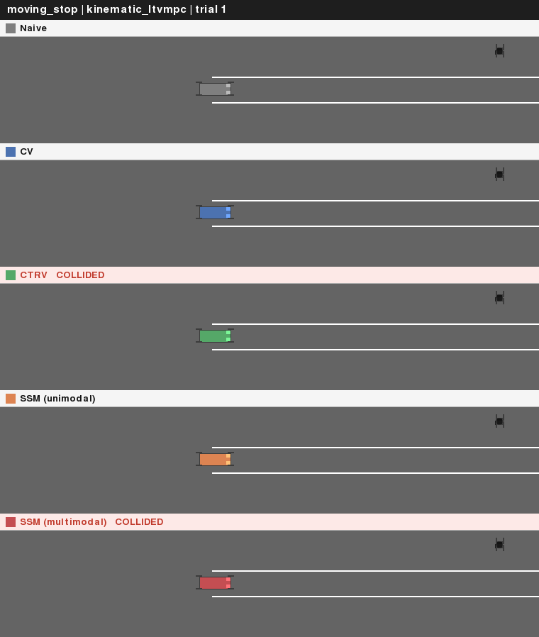
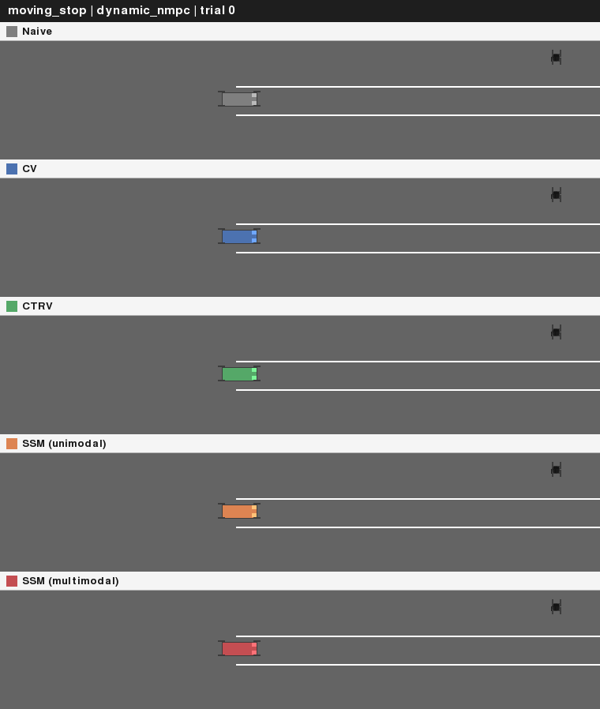
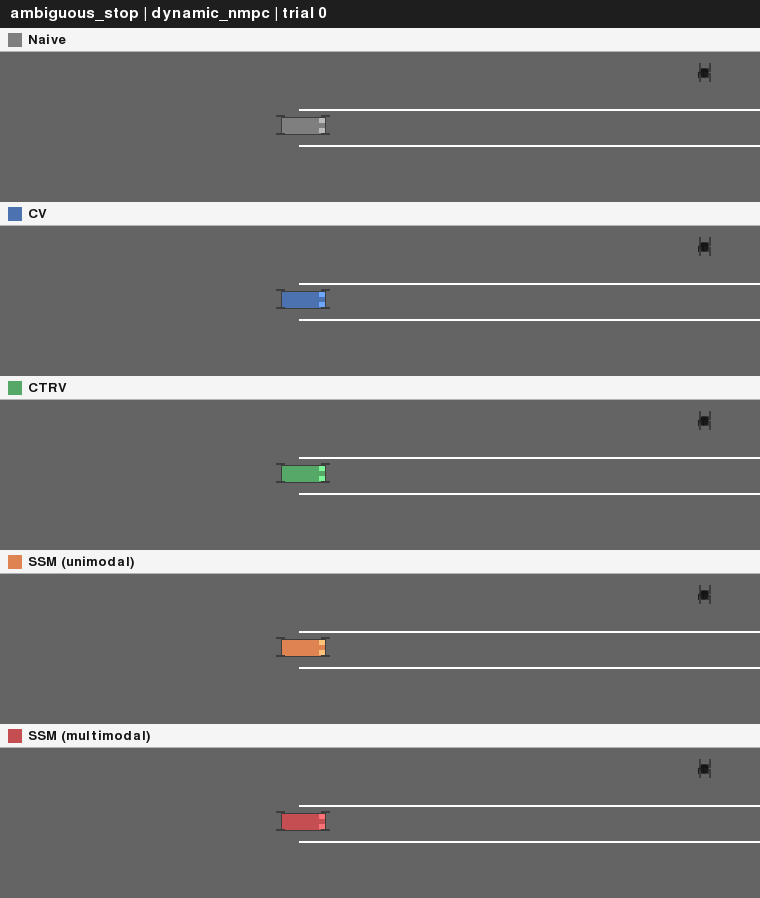

# Selective State-Space Prediction and Model Predictive Control for Safe Autonomous Driving

A from-scratch research project on trajectory prediction under uncertainty and Model
Predictive Control (MPC) for autonomous vehicle obstacle avoidance, built in five
incremental stages: a kinematic model + convex MPC baseline, a dynamic model + true
Nonlinear MPC with obstacle avoidance, a learned state-space (S4D) predictor for
moving obstacles, a multimodal extension for genuinely ambiguous obstacles with
scenario-based NMPC, and a full research-scale comparative study across every
controller/predictor combination with 2D simulator visualization.

Every result below is measured, not asserted — including results that don't flatter
this project's own methods (pure pursuit beats MPC on a circle; a QP-based obstacle
constraint that collides more often than NMPC's exact one) and the real bugs found
along the way (noted briefly per section; each is a case where a plausible-looking
number turned out to be wrong for a specific, traceable reason).


## Table of contents

- [Results at a glance](#results-at-a-glance)
- [Part 1: kinematic model + LTV-MPC](#part-1-kinematic-model--ltv-mpc)
- [Part 2: dynamic model + NMPC](#part-2-dynamic-model--nmpc)
- [Part 3: moving-obstacle prediction with a learned state-space model](#part-3-moving-obstacle-prediction-with-a-learned-state-space-model)
- [Part 4: multimodal prediction + scenario-based NMPC](#part-4-multimodal-prediction--scenario-based-nmpc)
- [Part 5: comprehensive comparative study](#part-5-comprehensive-comparative-study)
- [Repository layout](#repository-layout)
- [Running it](#running-it)
- [References](#references)

## Results at a glance

- **Part 1** — LTV-MPC beats pure pursuit on maneuvers with changing curvature
  (figure-eight: 0.087 m vs. 0.164 m mean cross-track error) but loses on a constant
  circle (0.120 m vs. 0.009 m) — a real trade-off, not a uniform win.
- **Part 2** — The dynamic model + true NMPC widens that advantage further (0.035 m
  vs. 0.339 m on the figure-eight) and degrades more gracefully than pure pursuit
  under crosswind/sensor noise.
- **Part 3** — A learned S4D state-space predictor beats CV/CTRV baselines on
  trajectory forecasting (ADE 0.482 m vs. 0.704 m vs. 1.515 m) and gives the safest,
  most consistent moving-obstacle avoidance in an NMPC-integrated demo.
- **Part 4** — A 2-hypothesis multimodal predictor + scenario-based NMPC handles a
  provably ambiguous obstacle (might stop, might not — unresolvable from the
  observed window alone) by staying clear of both hypotheses at once, winning the
  safety-critical case on average margin.
- **Part 5** — The full ablation matrix (2 controllers × 5 predictors × 3 scenarios,
  30 cells): **dynamic model + NMPC had zero collisions in every cell**; kinematic
  model + LTV-MPC collided in 4 of 15. Best overall system: **dynamic + NMPC +
  multimodal SSM**. See [Part 5](#part-5-comprehensive-comparative-study) for the
  full breakdown, figures, and a direct publication-readiness assessment.

The full ablation figures and 2D simulator comparison clips are in
[Part 5](#part-5-comprehensive-comparative-study) below.

## Part 1: kinematic model + LTV-MPC


The vehicle is modeled with the standard **kinematic bicycle model** (state
`[X, Y, psi, v]`, control `[a, delta]`, no tire slip — see
[`src/vehicle_model.py`](src/vehicle_model.py)):

```
X_dot = v*cos(psi)      Y_dot = v*sin(psi)
psi_dot = (v/L)*tan(delta)      v_dot = a
```

Since these dynamics are nonlinear, the controller **linearizes about the reference
path at every control step** (a fresh time-varying linear system each solve, not a
single offline linearization), giving a convex QP solved with `cvxpy`/OSQP:

```
minimize    sum_k (x_k - x_ref_k)'Q(x_k - x_ref_k) + u_k'Ru_k + (u_k-u_{k-1})'Rd(u_k-u_{k-1})
subject to  x_{k+1} = A_k x_k + B_k u_k + C_k,  actuator + actuator-rate limits
```

Only the first control is applied each step (receding horizon). Benchmarked against
classical **pure pursuit** (fixed lookahead point, `delta = atan2(2L*sin(alpha), Ld)`,
[`src/baseline_controller.py`](src/baseline_controller.py)):

| Trajectory | Controller | Mean \|error\| | Max \|error\| |
|---|---|---|---|
| Figure-eight | **MPC** | **0.087 m** | **0.261 m** |
| Figure-eight | Pure pursuit | 0.164 m | 0.486 m |
| Double lane change | **MPC** | **0.013 m** | **0.067 m** |
| Double lane change | Pure pursuit | 0.059 m | 0.227 m |
| Constant-radius circle | MPC | 0.120 m | 0.248 m |
| Constant-radius circle | **Pure pursuit** | **0.009 m** | **0.011 m** |

MPC's horizon look-ahead wins whenever the reference curvature changes; pure
pursuit's simple geometric law is a near-perfect fit for constant curvature and
edges MPC out there. **Engineering note:** heading (`psi`) is kept unbounded rather
than wrapped to `[-pi, pi]` throughout the codebase — a wrapped heading makes a
`-3.10 rad` vs. `+3.10 rad` pair (physically 0.08 rad apart) look ~6.2 rad apart to
the quadratic cost, and the controller fights a phantom error. `np.unwrap` in
[`src/trajectory.py`](src/trajectory.py) fixes this.

## Part 2: dynamic model + NMPC

The kinematic model assumes zero tire slip, which breaks down at higher speed/lateral
acceleration. [`src/dynamic_vehicle_model.py`](src/dynamic_vehicle_model.py) adds a
**dynamic bicycle model** with a linear tire law (state adds `vx, vy, r`; slip angles
`alpha_f, alpha_r` drive lateral tire forces `Fy = C_alpha * alpha`, saturated via
`tanh`). **Validated against closed-form steady-state cornering theory**: 0.33% error
vs. the analytic yaw-rate formula, and the resulting turn radius (33.4 m) is
correctly larger than the kinematic model's zero-slip prediction (30.9 m) — the
understeer effect a kinematic model can't produce (`python
src/validate_dynamic_model.py`).

Because the extra states don't linearize as cleanly, this model is controlled by a
**true Nonlinear MPC**: [`src/nmpc_controller.py`](src/nmpc_controller.py) builds the
optimal-control problem symbolically in CasADi (direct multiple shooting, RK4-
discretized nonlinear dynamics, verified bit-identical between NumPy and CasADi
evaluations) and solves with IPOPT — no linearization at all.

| Trajectory | Controller | Mean \|error\| | Max \|error\| |
|---|---|---|---|
| Figure-eight | **NMPC** | **0.035 m** | **0.136 m** |
| Figure-eight | Pure pursuit | 0.339 m | 1.097 m |
| Double lane change | **NMPC** | **0.011 m** | **0.132 m** |
| Double lane change | Pure pursuit | 0.052 m | 0.211 m |

Against the harder dynamic model, NMPC's advantage over pure pursuit *widens* —
pure pursuit has no way to compensate for tire slip. Under crosswind + sensor/process
noise (6 Monte Carlo trials, identical disturbance realizations across controllers),
NMPC degrades most gracefully (0.113 ± 0.008 m) vs. LTV-MPC (0.140 ± 0.007 m) vs.
pure pursuit (0.230–0.236 m); see
[`src/robustness_experiment.py`](src/robustness_experiment.py).

**Obstacle avoidance** extends naturally to NMPC's nonconvex constraints — something
a QP can't handle directly. Each static circular obstacle adds a hard keep-out
constraint `(X_k-ox)^2 + (Y_k-oy)^2 >= radius^2` over the whole horizon:

| Obstacle (X, Y, radius) | Avoidance off | Avoidance on |
|---|---|---|
| (40.0, 0.4, 1.5 m) | 0.40 m — **collision** | 1.64 m — clear |
| (70.0, -0.6, 1.3 m) | 0.70 m — **collision** | 1.44 m — clear |


**Engineering notes (real bugs found while stress-testing/benchmarking):** an initial
guess seeded directly from the reference path wasn't dynamically feasible, which
under sensor noise cascaded into 15-20 consecutive solve failures before recovering —
fixed by forward-simulating a *consistent* guess from the true current state.
A follow-up guess used zero acceleration by default, which could permanently latch
the controller at a fixed speed if one solve failed while accelerating from a stop —
fixed with an adaptive proportional guess. A hard `max()` in the tire model's
low-speed guard was also non-differentiable exactly where IPOPT's gradient search
needed it smooth — replaced with a smooth approximation. Full root-cause writeups for
all three are preserved in the codebase's docstrings/comments.

## Part 3: moving-obstacle prediction with a learned state-space model

Static obstacle constraints are wrong for anything that moves by the time the ego
vehicle arrives. [`src/ssm_predictor.py`](src/ssm_predictor.py) implements an
encoder-decoder **S4D structured state-space sequence model** (Gu, Goel, Ré 2022; Gu,
Gupta, Goel, Ré 2022) — each channel an independent diagonal linear SSM with a
learned decay/oscillation eigenvalue — that encodes the 10 most recent observed
displacements and autoregressively decodes 10 future steps, feeding directly into
NMPC's obstacle constraint (extended to accept a time-varying `(H+1, 2)` predicted
center, one per horizon step, not just a static point).

**Test-set results** (held out, research-scale selective SSM, ~330k params — see
[Part 5](#part-5-comprehensive-comparative-study) for the architecture upgrade):

| Predictor | ADE | FDE |
|---|---|---|
| **SSM (learned)** | **0.482 ± 0.329 m** | **0.927 ± 0.654 m** |
| CV | 0.704 ± 0.454 m | 1.381 ± 0.860 m |
| CTRV | 1.515 ± 0.906 m | 2.996 ± 1.856 m |

**Moving-obstacle avoidance demo** (dynamic model + NMPC, pedestrian decelerating to
a stop mid-crossing, 8 Monte Carlo trials, identical true trajectory + sensor noise
per trial across all three methods):

| Method | Closest approach | Max lateral deviation | Collisions |
|---|---|---|---|
| Naive (last-seen position) | 1.75 ± 0.02 m | 1.89 ± 0.22 m | 0/8 |
| CV | 1.50 ± 0.49 m | 2.22 ± 1.01 m | 0/8 |
| **SSM (learned)** | **1.74 ± 0.10 m** | 2.07 ± 0.48 m | 0/8 |


The honest reading: naive's low variance is an artifact of never reacting at all, not
evidence it "understands" anything; SSM is the only method that recognizes the
pedestrian decelerating and reacts — the advantage that matters once the scenario
gets harder (see [Part 5](#part-5-comprehensive-comparative-study), where naive's
blind consistency stops being safe and it collides while SSM doesn't).

**Engineering notes:** getting an honest number here took three fixes — noiseless
synthetic data initially let CV score a trivial 0.000 ADE by construction (fixed by
adding sensor noise); freezing that noise per-example let the model memorize it
instead of generalizing (fixed by redrawing noise fresh every epoch); and even with
that fixed, validation loss still got worse over training due to **exposure bias** —
teacher-forced training never practices recovering from the model's own prediction
errors, which is all it sees at inference (fixed with scheduled sampling, annealing
teacher-forcing probability from 1.0 to 0.0 over training; Bengio et al. 2015). A
third, separate bug — the NMPC obstacle-avoidance fallback path had zero knowledge of
obstacles, so a failed solve near an obstacle could drive straight through it — is
also fixed here (`_build_consistent_guess` now falls back to the previous
obstacle-aware solution, not an obstacle-blind one), dropping collisions from
`cv: 2/8, ssm: 1/8` to 0/8 for all three methods.

## Part 4: multimodal prediction + scenario-based NMPC

Part 3's predictor is unimodal — one output per input. That breaks down for a
genuinely ambiguous obstacle: a pedestrian who might keep walking or might stop, with
nothing in their observed gait revealing which. `src/obstacle_trajectory_data.py`'s
`"branch"` pattern is built so this ambiguity is *provable*, not just noisy: every
observed step is statistically identical regardless of the eventual outcome, decided
by an independent coin flip exactly at the observation boundary.
`MultimodalObstaclePredictor` decodes 2 independent hypotheses from a shared encoder,
and `nmpc_controller.py` treats each as its own hard constraint simultaneously
(**scenario-based avoidance** — stay clear of every plausible future at once, rather
than betting on one).

**Demo results** (identical NMPC controller, true outcome forced to each branch for
equal representation, 6 trials each):

| Prediction strategy | Margin — pedestrian stops | Margin — pedestrian continues | Collisions |
|---|---|---|---|
| CV | 1.61 ± 0.27 m | **2.62 ± 0.53 m** | 0/12 |
| Unimodal SSM | 1.70 ± 0.07 m | 2.50 ± 0.60 m | 0/12 |
| **Multimodal SSM** | **1.79 ± 0.14 m** | 2.58 ± 0.52 m | 0/12 |


The multimodal predictor wins the safety-critical case on *average* margin, not on
consistency — the unimodal SSM's 0.07 m std is actually the tightest of the three.
Hedging against two hypotheses buys a better average outcome, not a uniformly
tighter one.

**Engineering notes (three real rounds to get a mixture model to actually
specialize):** plain winner-take-all training collapsed both modes onto nearly
identical output (a rich-get-richer instability). Backpropagating the mode
classifier's loss into the shared encoder made it worse, since the encoder got
dragged toward a signal that provably isn't in the input — fixed by detaching the
encoder before the classifier head. Unsupervised mode discovery still didn't
specialize reliably, so training uses a `forced_winner` (the known synthetic go/stop
label supervises *which* mode gets the gradient, at training time only — not input
leakage). Result: mode *assignment* is clean (98.2% / 100% correct), and mode
*behavior* is meaningfully different and correctly ordered (predicted displacement
1.92 m "confident" vs. 0.84 m "cautious," against true values 1.99 m / 0.47 m) though
not perfectly resolved — reported as real, checkable, improved specialization, not a
fully solved bimodal fit.

## Part 5: comprehensive comparative study

Parts 1-4 each compare a *pair* of things on the scenario that part introduced. This
section puts every controller and every prediction method on the same scenarios at
the same time: **{kinematic + LTV-MPC, dynamic + NMPC} × {naive, CV, CTRV, unimodal
SSM, multimodal SSM}**, a 10-cell matrix run on 3 standardized scenarios (30 cells
total, 4 trials each), in [`src/comparative_study.py`](src/comparative_study.py). It
also does two things the individual parts didn't need: gives the kinematic model's QP
controller obstacle avoidance for the first time (a linearized convex supporting-
half-plane approximation of the circular keep-out constraint, since a QP can't
represent it exactly — [`src/mpc_controller.py`](src/mpc_controller.py)), and scales
both predictors from architecture demos to genuine research scale.

**Selective (Mamba-style) SSM upgrade.** `SelectiveS4DLayer` makes the SSM's
discretization step a *learned function of the current input* (Gu & Dao's Mamba,
2023/2024) instead of a fixed constant — the mechanism responsible for most of
Mamba's improvement over plain S4 in the original paper's own ablations. Combined
with more capacity, `ObstaclePredictor` grew ~27.6k → ~330k params and
`MultimodalObstaclePredictor` ~15.9k → ~212k params; both improved measurably (Part
3/4 numbers above are this upgraded model's).

### Results


**The controller matters more than the predictor for collision-freedom.**
Dynamic model + NMPC had **zero collisions in all 15 of its cells**, regardless of
predictor. Kinematic model + LTV-MPC **collided in 4 of 15** — naive and CTRV on
Scenario A, CTRV on Scenario B1, and, most notably, **multimodal SSM on the
non-ambiguous Scenario A (2/4 trials)**: its two simultaneous linearized
hypothesis-constraints occasionally conflict with each other or actuator limits in a
way NMPC's exact nonconvex constraint never does.

**On the safety-critical ambiguous-stop scenario**, dynamic + NMPC + multimodal SSM
gets the best mean closest-approach of all five methods (1.92 m) — the Part 4 finding
holds up under the full comparison. Under kinematic + LTV-MPC the same scenario is
much flatter (1.41–1.53 m across all five methods) — the convex approximation's
extra conservatism washes out most of a better predictor's edge.

**Solve time inverts the naive expectation.** LTV-MPC's QP solves in 83 ms mean / 197
ms worst-case; NMPC's IPOPT is faster on average (29 ms) but spikes to 1.7 s
worst-case — over an order of magnitude above the QP's own worst case, consistent
with Part 2's original finding.

### 2D simulator comparison (highway-env)

[`src/render_highwayenv.py`](src/render_highwayenv.py) replays this study's recorded
trajectories inside [highway-env](https://github.com/Farama-Foundation/HighwayEnv)
(Leurent, 2018) — only its road/vehicle *rendering*, not its physics or
decision-making; every trajectory drawn is exactly what this project's own validated
controllers produced, a replay rather than a re-simulation. Each prediction method
gets its own panel — own camera, centered on its own ego — stacked vertically into
one synced clip, rather than sharing one scene: an earlier shared-scene version could
push a still-moving method's vehicle out of frame (camera centered on the mean of 5
diverging positions) and made overlapping rotated vehicles visually hard to tell
apart. Per-panel rendering removes both problems structurally.







Reproduce the full study with `python src/comparative_study.py` (~15 min on 2 CPU
cores), then `python src/research_plots.py` for the figures and `pip install
highway-env imageio && python src/render_highwayenv.py` for the simulator replays.

### Which combination is best, and is this publication-ready?

**Best system: dynamic bicycle model + NMPC + multimodal SSM** — the only cell with
zero collisions everywhere, and the best safety margin on the hardest case. If a
single deployable recommendation were needed: NMPC + multimodal SSM for
safety-critical prediction under ambiguity, with LTV-MPC's QP as a lighter-weight
fallback where NMPC's tail latency isn't acceptable.

**Publication readiness, stated plainly:** this is solid technical-report/portfolio
quality — a real ablation matrix, matched-trial design, an honest per-trial (not just
mean) visualization, a real 2D simulator replay, 21 references spanning 2024-2026
SSM/MPC literature. It is **not** peer-review quality yet, for four concrete reasons:
4 trials/cell is too few for a defensible confidence interval; 3 scenario families is
narrow; CV/CTRV are reasonable but not the field's strongest current baselines (a
submission would want a learned baseline like Trajectron++ or MTR); and all data is
synthetic, with no real recorded pedestrian/vehicle trajectories.

## Repository layout

```
.
├── src/
│   ├── vehicle_model.py           # kinematic bicycle model: dynamics, RK4 step, linearization
│   ├── dynamic_vehicle_model.py   # dynamic bicycle model: tire slip, linear tire forces
│   ├── validate_dynamic_model.py  # steady-state cornering + NumPy/CasADi bit-identical checks
│   ├── trajectory.py              # reference path generators + arc-length horizon lookup
│   ├── mpc_controller.py          # LTV-MPC (cvxpy/OSQP) -- kinematic model + obstacle avoidance
│   ├── nmpc_controller.py         # NMPC (CasADi/IPOPT) -- dynamic model + obstacle avoidance
│   ├── baseline_controller.py     # pure pursuit + PI speed control
│   ├── simulate.py                # closed-loop simulation harness
│   ├── obstacle_demo.py           # static obstacle avoidance: before/after comparison
│   ├── robustness_experiment.py   # crosswind/noise Monte Carlo study
│   ├── robustness_plot.py         # bar chart of the robustness study
│   ├── obstacle_trajectory_data.py # synthetic moving-obstacle motion patterns + noise augmentation
│   ├── ssm_predictor.py           # S4D / selective-S4D trajectory predictor (uni + multimodal)
│   ├── trajectory_baselines.py    # CV / CTRV classical baselines + ADE/FDE metrics
│   ├── train_predictor.py         # trains + validates the unimodal SSM predictor
│   ├── moving_obstacle_demo.py    # moving-obstacle NMPC demo: naive vs. CV vs. SSM
│   ├── train_multimodal_predictor.py # trains the 2-hypothesis mixture SSM predictor
│   ├── multimodal_obstacle_demo.py   # scenario-based NMPC demo: CV vs. unimodal vs. multimodal
│   ├── comparative_study.py       # Part 5: full {controller} x {method} x {scenario} ablation matrix
│   ├── research_plots.py          # Part 5: bar/heatmap/solve-time figures
│   ├── render_highwayenv.py       # Part 5: 2D simulator replay + multi-method comparison panels
│   └── visualize.py               # shared plotting/GIF generation
├── notebooks/demo.ipynb           # walkthrough: derive, simulate, visualize, compare (Part 1)
├── results/                       # generated plots/GIFs/model weights (see below to regenerate)
├── app.py                         # interactive Streamlit demo (Part 1)
└── requirements.txt
```

## Running it

```bash
python -m venv venv && source venv/bin/activate   # optional but recommended
pip install -r requirements.txt

# Part 1
python src/simulate.py && python src/visualize.py
streamlit run app.py              # interactive: horizon, weights, trajectory, live

# Part 2
python src/validate_dynamic_model.py
python src/nmpc_demo.py && python src/obstacle_demo.py
python src/robustness_experiment.py && python src/robustness_plot.py

# Part 3 (research-scale selective SSM, ~330k params, ~15-20 min on 2 CPU cores)
python src/train_predictor.py && python src/moving_obstacle_demo.py

# Part 4 (research-scale, ~212k params, ~10 min)
python src/train_multimodal_predictor.py && python src/multimodal_obstacle_demo.py

# Part 5
python src/comparative_study.py       # full 2x5x3 ablation matrix (~15 min)
python src/research_plots.py
pip install highway-env imageio && python src/render_highwayenv.py
```

**Solve times, measured, not assumed:**

| Trajectory | Controller | Mean | Median | Max |
|---|---|---|---|---|
| Figure-eight | NMPC | 26.8 ms | **24.0 ms** | 737.9 ms |
| Figure-eight | LTV-MPC | 90.2 ms | 81.5 ms | 152.6 ms |
| Double lane change | NMPC | 108.0 ms | **21.2 ms** | 1450.5 ms |
| Double lane change | LTV-MPC | 84.8 ms | 77.9 ms | 131.3 ms |

The *median* NMPC solve is faster than the QP's once warm-started near the optimum,
but its *worst* case is far heavier — concentrated in accelerating hard from a
standing start, where IPOPT's iteration count depends on how hard the maneuver is in
a way OSQP's per-solve cost doesn't.

## References

**Vehicle dynamics and MPC**

1. R. Rajamani, *Vehicle Dynamics and Control*, Springer, 2011.
2. J. Kong et al., "Kinematic and dynamic vehicle models for autonomous driving
   control design," *IEEE Intelligent Vehicles Symposium*, 2015.
3. R. C. Coulter, "Implementation of the Pure Pursuit Path Tracking Algorithm," CMU
   Robotics Institute Technical Report, 1992.
4. J. B. Rawlings, D. Q. Mayne, M. Diehl, *Model Predictive Control: Theory,
   Computation, and Design*, 2nd ed., Nob Hill Publishing, 2017.
5. J. A. E. Andersson et al., "CasADi -- A software framework for nonlinear
   optimization and optimal control," *Mathematical Programming Computation*, 2019.
6. A. Wächter, L. T. Biegler, "On the implementation of an interior-point filter
   line-search algorithm for large-scale nonlinear programming," *Mathematical
   Programming*, 2006 — IPOPT.

**Learning-based and uncertainty-aware MPC (2024-2026)**

7. T. Power, D. Berenson, "Diffusion-Based Model Predictive Control,"
   arXiv:2410.05364, 2024.
8. Y. Cao et al., "Dynamic Obstacle Avoidance of UAV Using Chance Constrained Model
   Predictive Control," *Optimal Control Applications and Methods*, 2025.
9. H. Ren, Y. Li, Y. Wang, C.-K. Chen, L. Yang, Y. Zhao, "Learning-based model
   predictive control for safe path planning and control," *Proc. IMechE Part D*,
   2025.
10. "Trajectory Planning with Model Predictive Control for Obstacle Avoidance
    Considering Prediction Uncertainty," *Advanced Engineering Informatics*, 2025.
11. W. Zhan et al., "A Survey on Learning-Based Model Predictive Control: Toward
    Path Tracking Control of Mobile Platforms," *Applied Sciences* 12(4), 2022.

**State-space models and selective SSMs (Mamba)**

12. A. Gu, K. Goel, C. Ré, "Efficiently Modeling Long Sequences with Structured
    State Spaces," *ICLR*, 2022 — S4.
13. A. Gu, A. Gupta, K. Goel, C. Ré, "On the Parameterization and Initialization of
    Diagonal State Space Models," *NeurIPS*, 2022 — S4D.
14. A. Gu, T. Dao, "Mamba: Linear-Time Sequence Modeling with Selective State
    Spaces," arXiv:2312.00752, 2023 (rev. 2024).
15. S. Bengio, O. Vinyals, N. Jaitly, N. Shazeer, "Scheduled Sampling for Sequence
    Prediction with Recurrent Neural Networks," *NeurIPS*, 2015.

**Trajectory prediction and multimodal forecasting (incl. 2024-2026 Mamba-based work)**

16. H. Cui et al., "Multimodal Trajectory Predictions for Autonomous Driving using
    Deep Convolutional Networks," *ICRA*, 2019 — the winner-take-all MTP loss.
17. Y. Huang et al., "Trajectory Mamba: Efficient Attention-Mamba Forecasting Model
    Based on Selective SSM," *CVPR*, 2025.
18. "KD-Mamba: Selective State Space Models with Knowledge Distillation for
    Trajectory Prediction," *Information Fusion*, 2025.
19. "Large Foundation Models for Trajectory Prediction in Autonomous Driving: A
    Comprehensive Survey," arXiv:2509.10570, 2025.
20. "Recent Advances in Multi-Agent Human Trajectory Prediction: A Comprehensive
    Review," arXiv:2506.14831, 2025.

**Simulation**

21. E. Leurent, "An Environment for Autonomous Driving Decision-Making,"
    [github.com/Farama-Foundation/HighwayEnv](https://github.com/Farama-Foundation/HighwayEnv),
    2018.
